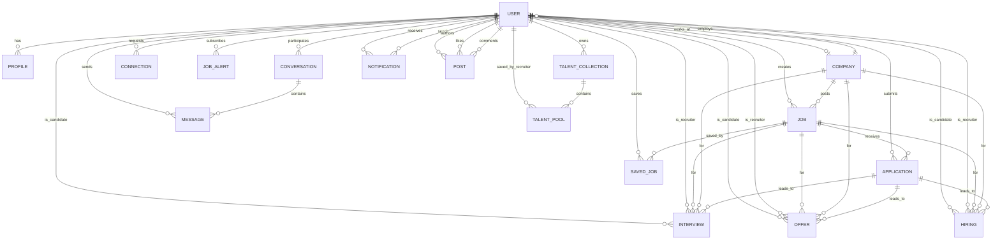

# InternLink System Design & Scalability Analysis

> This document describes the current architecture of InternLink based on the repository as analyzed on 2026-08-22.
>
> This is a baseline architecture analysis. No scalability optimizations are implemented by this document.

---

## Analysis Status

- Current architecture documented: Yes
- Database architecture documented: Yes
- Request flows documented: Yes
- Existing indexes documented: Yes
- Scalability risks identified: Yes
- Code modified: No
- Optimization implemented: No

---

## Table of Contents

1. [Current Technology Stack](#1-current-technology-stack)
2. [Repository Structure](#2-repository-structure)
3. [System Architecture Diagram](#3-system-architecture-diagram)
4. [Architecture Explanation](#4-architecture-explanation)
5. [Request Lifecycle](#5-request-lifecycle)
6. [Backend Architecture](#6-backend-architecture)
7. [Frontend Architecture](#7-frontend-architecture)
8. [MongoDB Database Architecture](#8-mongodb-database-architecture)
9. [MongoDB Query Analysis](#9-mongodb-query-analysis)
10. [Current Index Analysis](#10-current-index-analysis)
11. [Authentication Architecture](#11-authentication-architecture)
12. [Authorization Architecture](#12-authorization-architecture)
13. [File and CV Storage](#13-file-and-cv-storage)
14. [Search and Filtering Architecture](#14-search-and-filtering-architecture)
15. [Pagination Analysis](#15-pagination-analysis)
16. [Chat Architecture](#16-chat-architecture)
17. [Notification Architecture](#17-notification-architecture)
18. [External Services](#18-external-services)
19. [Deployment Architecture](#19-deployment-architecture)
20. [Docker Architecture](#20-docker-architecture)
21. [Current Scalability Characteristics](#21-current-scalability-characteristics)
22. [Bottleneck Analysis](#22-bottleneck-analysis)
23. [Database Bottlenecks](#23-database-bottlenecks)
24. [Backend Bottlenecks](#24-backend-bottlenecks)
25. [Frontend Performance Risks](#25-frontend-performance-risks)
26. [Single Point of Failure Analysis](#26-single-point-of-failure-analysis)
27. [Current Architecture — One Page Summary](#27-current-architecture--one-page-summary)
28. [Future Scalability Roadmap](#28-future-scalability-roadmap)
29. [What I Should Learn From This Architecture](#29-what-i-should-learn-from-this-architecture)

---

## 1. Current Technology Stack

| Technology | What It Is | Where It Is Used | Why It Exists | Layer |
|------------|------------|------------------|---------------|-------|
| **React 18** | Frontend UI library | `frontend/src/` | Builds the user interface | Frontend |
| **Vite** | Frontend build tool | `frontend/` | Fast development server and bundling | Frontend |
| **React Router v6** | Client-side routing | `frontend/src/App.jsx` | Navigation between pages | Frontend |
| **Tailwind CSS v4** | CSS utility framework | `frontend/tailwind.config.js` | Styling | Frontend |
| **Axios** | HTTP client | `frontend/src/services/api.js` | API communication | Frontend |
| **Socket.IO Client** | WebSocket client | `frontend/src/context/SocketContext.jsx` | Real-time chat/notifications | Frontend |
| **Framer Motion** | Animation library | `frontend/src/` | UI animations | Frontend |
| **Express.js** | Node.js web framework | `backend/server.js` | Backend API server | Backend |
| **Node.js** | JavaScript runtime | `backend/` | Runs the backend server | Backend |
| **MongoDB** | NoSQL document database | Referenced via `MONGO_URI` | Primary data store | Database |
| **Mongoose** | MongoDB ODM | `backend/models/*.js` | Schema definition, queries, validation | Backend/DB |
| **JWT** | JSON Web Tokens | `backend/middlewares/authMiddleware.js`, `backend/controllers/authController.js` | Stateless authentication | Backend |
| **bcryptjs** | Password hashing | `backend/models/User.js` | Secure password storage | Backend |
| **Passport.js** | Authentication middleware | `backend/config/passport.js` | OAuth flow management | Backend |
| **Google OAuth 2.0** | Social login | `backend/config/passport.js` | Google login | External/Backend |
| **GitHub OAuth** | Social login | `backend/config/passport.js` | GitHub login | External/Backend |
| **Cloudinary** | Cloud file storage | `backend/utils/cloudinary.js` | File uploads (resumes, avatars, images) | External/Backend |
| **Nodemailer** | Email sending | `backend/utils/sendEmail.js` | Transactional emails | External/Backend |
| **OpenRouter / OpenAI** | AI/LLM API | `backend/config/openrouter.js`, `backend/controllers/aiController.js` | AI assistant chat | External/Backend |
| **Socket.IO** | WebSocket library | `backend/server.js` | Real-time messaging and notifications | Backend |
| **Multer** | Multipart file upload | `backend/middlewares/uploadMiddleware.js` | File upload parsing | Backend |
| **Helmet** | Security headers | `backend/server.js` | HTTP security headers | Backend |
| **express-rate-limit** | Rate limiting | `backend/middlewares/rateLimiter.js` | Brute-force protection | Backend |
| **express-mongo-sanitize** | NoSQL injection prevention | `backend/server.js` | Security | Backend |
| **xss-clean** | XSS prevention | `backend/server.js` | Security | Backend |
| **compression** | Response compression | `backend/server.js` | Reduce response size | Backend |
| **cookie-parser** | Cookie parsing | `backend/server.js` | Cookie handling | Backend |
| **csurf** | CSRF protection | `backend/server.js` | CSRF token generation | Backend |
| **dotenv** | Environment variables | `backend/server.js` | Configuration management | Backend |
| **express-validator** | Request validation | `backend/middlewares/validationMiddleware.js` | Input validation | Backend |
| **Sass** | CSS preprocessor | `frontend/` | Styling (legacy modules) | Frontend |
| **Vercel** | Hosting platform | `frontend/vercel.json` | Frontend deployment | Infrastructure |

### Technologies NOT Found

- Redis: Not present
- Message Queue (BullMQ, RabbitMQ, Kafka): Not present
- Docker / Docker Compose: Not present
- CI/CD configuration: Not present
- CDN: Not present (Cloudinary serves uploaded files but is not a CDN for frontend assets)
- Elasticsearch / Search Engine: Not present
- Load Balancer: Not present
- Monitoring / APM: Not present

---

## 2. Repository Structure

```
InternLink/
+-- backend/
¦   +-- config/
¦   ¦   +-- db.js              # MongoDB connection
¦   ¦   +-- cors.js            # CORS & OAuth origin tracking
¦   ¦   +-- passport.js        # Google & GitHub OAuth strategies
¦   ¦   +-- openrouter.js      # OpenRouter AI client
¦   +-- controllers/
¦   ¦   +-- authController.js
¦   ¦   +-- jobController.js
¦   ¦   +-- messageController.js
¦   ¦   +-- notificationController.js
¦   ¦   +-- searchController.js  # Not found as separate file; search is inline in jobController
¦   ¦   +-- aiController.js
¦   ¦   +-- profileController.js
¦   ¦   +-- connectionController.js
¦   ¦   +-- postController.js
¦   ¦   +-- offerController.js
¦   ¦   +-- interviewController.js
¦   ¦   +-- hiringController.js
¦   ¦   +-- talentPoolController.js
¦   ¦   +-- recruiterProfileController.js
¦   ¦   +-- recruiterJobController.js
¦   ¦   +-- recruiterDashboardController.js
¦   ¦   +-- companyController.js
¦   ¦   +-- applicantController.js
¦   +-- middlewares/
¦   ¦   +-- authMiddleware.js
¦   ¦   +-- errorMiddleware.js
¦   ¦   +-- rateLimiter.js
¦   ¦   +-- uploadMiddleware.js
¦   ¦   +-- validationMiddleware.js
¦   ¦   +-- tokenBlacklist.js
¦   ¦   +-- recruiterOnly.js
¦   +-- models/
¦   ¦   +-- User.js
¦   ¦   +-- Profile.js
¦   ¦   +-- Job.js
¦   ¦   +-- Application.js
¦   ¦   +-- Company.js
¦   ¦   +-- Conversation.js
¦   ¦   +-- Message.js
¦   ¦   +-- Notification.js
¦   ¦   +-- Post.js
¦   ¦   +-- Offer.js
¦   ¦   +-- Interview.js
¦   ¦   +-- Hiring.js
¦   ¦   +-- TalentPool.js
¦   ¦   +-- TalentCollection.js
¦   ¦   +-- Connection.js
¦   ¦   +-- JobAlert.js
¦   ¦   +-- TokenBlacklist.js
¦   +-- routes/
¦   ¦   +-- authRoutes.js
¦   ¦   +-- profileRoutes.js
¦   ¦   +-- jobRoutes.js
¦   ¦   +-- recruiterJobRoutes.js
¦   ¦   +-- messageRoutes.js
¦   ¦   +-- notificationRoutes.js
¦   ¦   +-- searchRoutes.js
¦   ¦   +-- connectionRoutes.js
¦   ¦   +-- postRoutes.js
¦   ¦   +-- offerRoutes.js
¦   ¦   +-- interviewRoutes.js
¦   ¦   +-- hiringRoutes.js
¦   ¦   +-- talentPoolRoutes.js
¦   ¦   +-- recruiterProfileRoutes.js
¦   ¦   +-- recruiterDashboardRoutes.js
¦   ¦   +-- companyRoutes.js
¦   ¦   +-- applicantRoutes.js
¦   ¦   +-- aiRoutes.js
¦   ¦   +-- jobAlertRoutes.js
¦   +-- services/
¦   ¦   +-- notificationService.js
¦   ¦   +-- messageService.js
¦   ¦   +-- talentPoolService.js
¦   +-- utils/
¦   ¦   +-- sendEmail.js
¦   ¦   +-- emailQueue.js
¦   ¦   +-- cloudinary.js
¦   ¦   +-- reminderScheduler.js
¦   ¦   +-- regex.js
¦   +-- uploads/                 # Local file fallback storage
¦   +-- server.js                # Express app entry point
¦   +-- seed.js                  # Database seed script
¦   +-- package.json
+-- frontend/
¦   +-- src/
¦   ¦   +-- pages/
¦   ¦   ¦   +-- auth/            # Login, Register, VerifyEmail, ForgotPassword, ResetPassword
¦   ¦   ¦   +-- Student/        # Feed, Profile, Network, Jobs, Messages, Notifications, Settings, SearchResults, Interviews, Offers, Onboarding, AIAssistant
¦   ¦   ¦   +-- recruiter/      # Dashboard, Profile, CompanyAssociation, JobManagement, Applicants, Interviews, Offers, HiringOnboarding, Messages, TalentPool
¦   ¦   +-- components/
¦   ¦   ¦   +-- ProtectedRoute/
¦   ¦   ¦   +-- RecruiterProtectedRoute/
¦   ¦   ¦   +-- GuestRoute/
¦   ¦   ¦   +-- messages/
¦   ¦   ¦   +-- notifications/
¦   ¦   ¦   +-- talent/
¦   ¦   ¦   +-- ...
¦   ¦   +-- contexts/
¦   ¦   ¦   +-- AuthContext.jsx
¦   ¦   ¦   +-- SocketContext.jsx
¦   ¦   ¦   +-- ThemeContext.jsx
¦   ¦   ¦   +-- NotificationContext.jsx
¦   ¦   ¦   +-- MessageContext.jsx
¦   ¦   ¦   +-- OnlineStatusContext.jsx
¦   ¦   ¦   +-- AIContext.jsx
¦   ¦   +-- services/
¦   ¦   ¦   +-- api.js
¦   ¦   ¦   +-- aiService.js
¦   ¦   ¦   +-- messageService.js
¦   ¦   ¦   +-- notificationService.js
¦   ¦   ¦   +-- talentPoolService.js
¦   ¦   +-- layouts/
¦   ¦   ¦   +-- MainLayout/
¦   ¦   ¦   +-- AuthLayout/
¦   ¦   +-- App.jsx
¦   +-- vite.config.js
¦   +-- vercel.json
¦   +-- tailwind.config.js
¦   +-- package.json
+-- package.json                 # Root monorepo scripts
+-- .gitignore
+-- MESSAGE_REPLY_IMPLEMENTATION.md
```

### Package Managers

- **Root**: npm (concurrently for running both servers)
- **Backend**: npm
- **Frontend**: npm

---

## 3. System Architecture Diagram

```mermaid
flowchart TD
    User["User / Browser"]
    Frontend["React Frontend\n(Vite + React Router)\nHosted on Vercel"]
    Backend["Express.js Backend API\n(Port 5000)"]
    SocketIO["Socket.IO Server\n(same process as Express)"]
    Auth["Authentication Layer\n(JWT + Passport OAuth)"]
    DB[(MongoDB\n(Mongoose ODM))]
    Cloudinary["Cloudinary\n(File Storage)"]
    Email["SMTP Email\n(Nodemailer)"]
    AI["OpenRouter AI\n(OpenAI-compatible API)"]
    OAuth["OAuth Providers\n(Google / GitHub)"]

    User --> Frontend
    Frontend --> Backend
    Backend --> Auth
    Backend --> DB
    Backend --> Cloudinary
    Backend --> Email
    Backend --> AI
    Backend --> SocketIO
    SocketIO --> User
    Frontend --> OAuth
    OAuth --> Backend
    Backend --> OAuth
```

---

## 4. Architecture Explanation

### User ? Frontend

**What frontend is used:**
InternLink uses a single-page application (SPA) built with React 18 and Vite. The frontend is deployed separately from the backend (Vercel is configured via `frontend/vercel.json`).

**How pages communicate with the backend:**
The frontend uses Axios for HTTP requests. The API base URL is configured via `VITE_API_URL` in `frontend/src/services/api.js`. In development, Vite proxies `/api` and `/socket.io` requests to `http://localhost:5000`. In production, the frontend makes direct requests to the backend.

**API base URL:**
- Development: `http://localhost:5000` (via Vite proxy)
- Production: Configured via `VITE_API_URL` environment variable

**Authentication token handling:**
The JWT token is stored in `localStorage` as `token`. It is attached to every Axios request via an interceptor in `frontend/src/services/api.js`. On 401 responses, the token is cleared and the user is redirected to `/login`. A refresh token is stored in an HTTP-only cookie.

**Client-side state:**
Multiple React contexts manage global state:
- `AuthContext` — current user, login/logout
- `SocketContext` — Socket.IO connection and emits
- `NotificationContext` — notification state
- `MessageContext` — message state
- `ThemeContext` — theme preferences
- `OnlineStatusContext` — online user tracking
- `AIContext` — AI assistant state

Pages are lazy-loaded via `React.lazy()` for code splitting.

### Frontend ? Backend

**HTTP/HTTPS:**
All API communication is over HTTP in development. In production, HTTPS is expected (Vercel provides this for the frontend; the backend must be served over HTTPS or behind a reverse proxy).

**REST APIs:**
The backend exposes a REST API under `/api/*`. All routes are defined in `backend/routes/*.js`.

**API structure:**
- Base URL: `/api`
- Authentication routes: `/api/auth/*`
- Profile routes: `/api/profile/*`
- Job routes: `/api/jobs/*`
- Message routes: `/api/messages/*`
- Notification routes: `/api/notifications/*`
- Search routes: `/api/search/*`
- AI routes: `/api/ai/*`
- Recruiter routes: `/api/recruiter/*`, `/api/recruiter/jobs/*`, etc.

**Request/response flow:**
1. Frontend sends `Authorization: Bearer <token>` header
2. Express receives request
3. Rate limiter middleware checks request count
4. Route-specific middleware (e.g., `protect`) validates JWT
5. Controller processes request
6. Service layer (where present) handles business logic
7. Mongoose model interacts with MongoDB
8. Controller sends JSON response
9. Frontend receives response and updates state

**CORS:**
CORS is configured in `backend/config/cors.js`. Only specific origins are allowed:
- `https://internlink.adeelkhan.online`
- `https://intern-link-brrv.vercel.app`
- `http://localhost:5173`
- `http://127.0.0.1:5173`

**Authentication headers:**
The `protect` middleware extracts the Bearer token from `Authorization` header. Socket.IO authentication uses `socket.handshake.auth.token`.

### Backend ? Database

**MongoDB connection:**
Configured in `backend/config/db.js` using Mongoose. Connection pooling is configured with `maxPoolSize: 50` and `minPoolSize: 5`. The connection string comes from `MONGO_URI` environment variable, defaulting to `mongodb://localhost:27017/internlink`.

**Mongoose usage:**
All database interactions go through Mongoose models. Schemas define validation, defaults, and indexes.

**Models:**
- User, Profile, Job, Application, Company
- Conversation, Message
- Notification, Post
- Offer, Interview, Hiring
- TalentPool, TalentCollection
- Connection, JobAlert
- TokenBlacklist

**Queries:**
Queries use standard Mongoose methods: `find()`, `findOne()`, `findById()`, `findOneAndUpdate()`, `updateOne()`, `updateMany()`, `countDocuments()`, `aggregate()`, `populate()`.

**Population:**
Used extensively to resolve `_id` references to full documents (e.g., `populate('sender', 'name email')`, `populate('participants', 'name email role')`).

**Transactions:**
Not found in the current codebase. No explicit MongoDB transactions are used.

### Backend ? External Services

| Service | Purpose | Called By | Synchronous? | Failure Impact |
|---------|---------|-----------|--------------|----------------|
| **Cloudinary** | File upload (resumes, avatars, images) | `backend/utils/cloudinary.js` | Yes (await) | Upload fails; falls back to local filesystem if not configured |
| **SMTP (Nodemailer)** | Transactional emails (verification, password reset, interview, offers) | `backend/utils/sendEmail.js` | Yes (await) | Email not sent; registration/application still succeeds |
| **OpenRouter / OpenAI** | AI assistant chat | `backend/controllers/aiController.js` | Yes (await) | AI feature fails; rest of app works |
| **Google OAuth** | Social login | `backend/config/passport.js` | Yes (redirect flow) | Google login unavailable |
| **GitHub OAuth** | Social login | `backend/config/passport.js` | Yes (redirect flow) | GitHub login unavailable |

---

## 5. Request Lifecycle

### 5.1 User Registration

1. **User** submits registration form on `/register`
2. **Frontend** sends `POST /api/auth/register` with name, email, password, role, acceptedTerms
3. **Express route** `authRoutes.js` ? `validateRegister` middleware validates input
4. **Controller** `registerUser` in `authController.js`:
   - Checks if user exists
   - Creates verification token (SHA-256 hash)
   - Creates User record
   - Creates Profile record
   - Enqueues verification email via `emailQueue.js`
5. **Database** — User and Profile documents created in MongoDB
6. **Email Queue** — Email sent asynchronously via Nodemailer
7. **Response** — `201 Created` with `requiresVerification: true`
8. **Frontend** — Shows "check your email" message

**Route:** `POST /api/auth/register`
**Middleware:** `validateRegister`
**Controller:** `authController.registerUser`
**Database Models:** User, Profile
**External Service:** SMTP (via email queue)

---

### 5.2 User Login

1. **User** submits login form on `/login`
2. **Frontend** sends `POST /api/auth/login` with email, password, rememberMe
3. **Express route** ? `loginLimiter` middleware (10 attempts per 15 min)
4. **Controller** `loginUser`:
   - Finds user by email
   - Checks `authProvider` is `local`
   - Compares password with bcrypt
   - Checks `isVerified`
   - Generates JWT access token (1 day, or 30 days if rememberMe)
   - Generates refresh token (7 days, or 30 days if rememberMe)
   - Sets refresh token in HTTP-only cookie
   - Updates `lastLogin`
5. **Response** — `200 OK` with token and user data
6. **Frontend** — Stores token in localStorage, stores user in state

**Route:** `POST /api/auth/login`
**Middleware:** `loginLimiter`
**Controller:** `authController.loginUser`
**Database Model:** User
**External Service:** None

---

### 5.3 Google OAuth

1. **User** clicks "Sign in with Google"
2. **Frontend** redirects to `GET /api/auth/google?origin=<frontend_url>`
3. **Backend** — `captureOAuthOrigin` middleware stores origin in `oauthOriginMap` with nonce
4. **Passport** initiates Google OAuth flow
5. **Google** redirects back to `GET /api/auth/google/callback`
6. **Passport** verifies Google token, finds/creates User
7. **Controller** `oAuthSuccess`:
   - Generates JWT and refresh token
   - Sets refresh token cookie
   - Retrieves stored OAuth origin from nonce
   - Redirects to frontend: `<frontend_url>/oauth/callback?token=<jwt>&userId=<id>`
8. **Frontend** — `OAuthCallback` page stores token, fetches user data

**Route:** `GET /api/auth/google`, `GET /api/auth/google/callback`
**Middleware:** `captureOAuthOrigin`, Passport strategy
**Controller:** `authController.oAuthSuccess`
**Database Model:** User, Profile
**External Service:** Google OAuth

---

### 5.4 Internship Listing

1. **User** navigates to `/jobs`
2. **Frontend** sends `GET /api/jobs`
3. **Backend** — `generalLimiter`, `protect` middleware
4. **Controller** `getAllJobs` in `jobController.js`:
   - Builds query: `{ isActive: true }` plus optional regex filters for search, location, jobType, remote
   - Executes `Job.find(query).sort({ createdAt: -1 })`
5. **Database** — Returns all matching Job documents (no pagination)
6. **Response** — JSON array of jobs

**Route:** `GET /api/jobs`
**Middleware:** `generalLimiter`, `protect`
**Controller:** `jobController.getAllJobs`
**Database Model:** Job
**Important Query:** `Job.find({ isActive: true, $or: [...] }).sort({ createdAt: -1 })` with regex search

---

### 5.5 Internship Search/Filtering

1. **User** types in search bar
2. **Frontend** sends `GET /api/search?q=<query>`
3. **Backend** — `protect` middleware
4. **Controller** search logic in `searchRoutes.js`:
   - Sanitizes query with `escapeRegExp`
   - Searches Users by name/email regex (limit 5)
   - Searches Jobs by title/company/skills regex (limit 5)
   - Searches Posts by content regex (limit 5)
   - For each user found, fetches Profile separately
5. **Database** — Three parallel `find()` queries
6. **Response** — `{ people: [...], jobs: [...], posts: [...] }`

**Route:** `GET /api/search`
**Middleware:** `protect`
**Database Models:** User, Profile, Job, Post
**Important Queries:** Regex-based `$or` queries on text fields; no pagination; no text index utilization

---

### 5.6 Internship Details

1. **User** clicks on a job
2. **Frontend** sends `GET /api/jobs/:id`
3. **Backend** — `protect`, `validateObjectId`
4. **Controller** `getJobById`:
   - `Job.findById(req.params.id)`
5. **Database** — Single document lookup
6. **Response** — Job document

**Route:** `GET /api/jobs/:id`
**Middleware:** `protect`, `validateObjectId`
**Controller:** `jobController.getJobById`
**Database Model:** Job

### 5.7 Applying for an Internship

1. **User** submits application form
2. **Frontend** sends `POST /api/jobs/:id/apply` with coverLetter, useProfileResume, and file (resume PDF)
3. **Backend** — `protect`, `validateObjectId`, `upload.single('resume')` (Multer)
4. **Controller** `applyForJob`:
   - Verifies job exists
   - Checks if already applied (unique index on job+student)
   - Uploads resume to Cloudinary (or local filesystem)
   - Creates Application document
   - Creates notification for recruiter via `createNotification`
5. **Database** — Application created
6. **Notification** — Real-time notification emitted via Socket.IO to recruiter
7. **Response** — `201 Created` with application data

**Route:** `POST /api/jobs/:id/apply`
**Middleware:** `protect`, `validateObjectId`, `upload.single('resume')`
**Controller:** `jobController.applyForJob`
**Database Models:** Job, Application
**External Service:** Cloudinary (file upload)
**Real-time:** Socket.IO notification to recruiter

---

### 5.8 Saving an Internship

1. **User** clicks save/unsave button
2. **Frontend** sends `POST /api/jobs/:id/save`
3. **Backend** — `protect`, `validateObjectId`
4. **Controller** `toggleSaveJob`:
   - Finds job by ID
   - Toggles user ID in `savedBy` array
   - Saves job
5. **Database** — Job document updated
6. **Response** — `{ saved: true/false }`

**Route:** `POST /api/jobs/:id/save`
**Middleware:** `protect`, `validateObjectId`
**Controller:** `jobController.toggleSaveJob`
**Database Model:** Job

---

### 5.9 Updating Application Status

1. **Recruiter** changes application status
2. **Frontend** sends `PUT /api/applications/:id/status` with new status
3. **Backend** — `protect`, `validateObjectId`, `recruiterOnly`
4. **Controller** `updateApplicationStatus`:
   - Finds application
   - Updates status
   - Creates notification for student
5. **Database** — Application status updated
6. **Notification** — Real-time notification emitted to student
7. **Response** — Updated application document

**Route:** `PUT /api/applications/:id/status`
**Middleware:** `protect`, `validateObjectId`, `recruiterOnly`
**Controller:** `jobController.updateApplicationStatus`
**Database Model:** Application
**Real-time:** Socket.IO notification

### 5.10 Notifications

1. **System/User action** triggers notification creation
2. **Backend** calls `createNotification` service
3. **Service** creates Notification document, populates sender/recipient
4. **Socket.IO** — If recipient is online, emits `notification:new` event
5. **Frontend** — `NotificationContext` listens for events and updates UI
6. **User** can mark as read, delete, bulk actions via REST API

**Route:** Various (application submitted, interview scheduled, message received, etc.)
**Middleware:** Internal service call (no HTTP route for creation)
**Service:** `notificationService.createNotification`
**Database Model:** Notification
**Real-time:** Socket.IO

---

### 5.11 Chat/Message Sending

1. **User** sends message in `/messages/:conversationId`
2. **Frontend** sends `POST /api/messages/:conversationId` with text, optional file, replyTo
3. **Backend** — `protect`, `upload.single('file')` if file attached
4. **Controller** `sendMessage`:
   - Validates conversation participation
   - Checks mute status
   - Idempotency check via `clientMessageId`
   - Uploads attachment to Cloudinary if present
   - Creates Message document
   - Updates Conversation `lastMessage` and `lastMessageAt`
   - Emits `message:new` and `conversation:update` via Socket.IO to recipient
   - Creates notification for recipient
5. **Database** — Message and Conversation updated
6. **Real-time** — Recipient receives message via Socket.IO

**Route:** `POST /api/messages/:conversationId`
**Middleware:** `protect`, optional `upload.single('file')`
**Controller:** `messageController.sendMessage`
**Database Models:** Message, Conversation
**External Service:** Cloudinary (file upload)
**Real-time:** Socket.IO

---

### 5.12 CV Upload

CV/resume upload happens in two contexts:
1. **During job application** — via `POST /api/jobs/:id/apply` with `upload.single('resume')`
2. **Profile resume upload** — via `POST /api/profile/resume` with `upload.single('resume')`

Both use Multer memory storage, then `uploadToCloudinary` which:
- If Cloudinary is configured: uploads buffer to Cloudinary and returns `secure_url`
- If not configured: saves to local `backend/uploads/` directory and returns local URL

**Route:** `POST /api/jobs/:id/apply`, `POST /api/profile/resume`
**Middleware:** `upload.single('resume')`
**Controller:** `jobController.applyForJob`, `profileController.uploadResume`
**Database Models:** Application, Profile
**External Service:** Cloudinary (or local filesystem fallback)

### 5.13 Password Reset

1. **User** requests password reset on `/forgot-password`
2. **Frontend** sends `POST /api/auth/forgot-password` with email
3. **Backend** — `passwordResetLimiter`
4. **Controller** `forgotPassword`:
   - Finds user by email
   - Generates reset token (random bytes, SHA-256 hashed)
   - Sets `resetPasswordToken` and `resetPasswordExpire` (15 min)
   - Enqueues password reset email
5. **Email** — Sent asynchronously
6. **User** clicks link in email ? `GET /api/auth/validate-reset-token/:token`
7. **User** submits new password ? `POST /api/auth/reset-password/:token`
8. **Controller** `resetPassword`:
   - Validates token
   - Updates password (bcrypt hash on save via pre-save hook)
   - Clears reset token fields
9. **Response** — Success message

**Route:** `POST /api/auth/forgot-password`, `GET /api/auth/validate-reset-token/:token`, `POST /api/auth/reset-password/:token`
**Middleware:** `passwordResetLimiter`
**Controller:** `authController.forgotPassword`, `authController.resetPassword`
**Database Model:** User
**External Service:** SMTP

---

### 5.14 AI Functionality

1. **User** sends message on `/ai-assistant`
2. **Frontend** sends `POST /api/ai/chat` with message
3. **Backend** — `protect` middleware
4. **Controller** `aiController.chatWithAI`:
   - Sends request to OpenRouter API (`https://openrouter.ai/api/v1/chat/completions`)
   - Uses `nvidia/nemotron-3-ultra-550b-a55b:free` model
   - Returns AI response
5. **Response** — `{ success: true, reply: "..." }`

**Route:** `POST /api/ai/chat`
**Middleware:** `protect`
**Controller:** `aiController.chatWithAI`
**External Service:** OpenRouter (OpenAI-compatible API)

---

## 6. Backend Architecture

### Classification

The backend follows a **layered MVC architecture** with some service layer extraction:

```
Routes (express.Router)
  ?
Middleware (auth, validation, rate limiting, upload)
  ?
Controllers (request handling, response formatting)
  ?
Services (business logic, notification creation, message building)
  ?
Models (Mongoose schemas, queries)
  ?
MongoDB
```

### Routes

All routes are mounted in `backend/server.js`:

| Base Path | Router File | Purpose |
|-----------|-------------|---------|
| `/api/auth` | `authRoutes.js` | Registration, login, OAuth, password reset, account settings |
| `/api/profile` | `profileRoutes.js` | Profile CRUD, avatar/cover/resume upload, skills, education, experience, projects, certifications |
| `/api/connections` | `connectionRoutes.js` | Connection requests |
| `/api/posts` | `postRoutes.js` | Feed posts and comments |
| `/api/jobs` | `jobRoutes.js` | Job listings, applications, saved jobs, recommendations |
| `/api/recruiter/jobs` | `recruiterJobRoutes.js` | Recruiter-specific job management |
| `/api/job-alerts` | `jobAlertRoutes.js` | Job alert CRUD |
| `/api/search` | `searchRoutes.js` | Global search (people, jobs, posts) |
| `/api/messages` | `messageRoutes.js` | Conversations, messages, file uploads |
| `/api/notifications` | `notificationRoutes.js` | Notification CRUD, preferences |
| `/api/recruiter` | `recruiterProfileRoutes.js` | Recruiter profile |
| `/api/companies` | `companyRoutes.js` | Company management |
| `/api/recruiter/dashboard` | `recruiterDashboardRoutes.js` | Recruiter analytics |
| `/api/applicants` | `applicantRoutes.js` | Applicant management |
| `/api/interviews` | `interviewRoutes.js` | Interview scheduling |
| `/api/offers` | `offerRoutes.js` | Offer management |
| `/api/hiring` | `hiringRoutes.js` | Hiring/onboarding |
| `/api/talent-pool` | `talentPoolRoutes.js` | Talent pool management |
| `/api/ai` | `aiRoutes.js` | AI chat |

### Controllers

Controllers are in `backend/controllers/`. Each controller handles HTTP request/response for a specific domain. They contain business logic directly (no separate service layer for most operations, except notifications and messages).

### Services

Three service files exist:
- `notificationService.js` — `createNotification`, `getNotificationStats`, preference management
- `messageService.js` — Conversation creation, payload building, file validation, mute checks
- `talentPoolService.js` — Talent pool business logic

### Middleware

| Middleware | Purpose |
|------------|---------|
| `authMiddleware.js` | JWT verification, token blacklist check, user lookup |
| `errorMiddleware.js` | 404 handler, global error handler |
| `rateLimiter.js` | Auth (10/15min), login (10/15min), general (100/15min), password reset (5/hour) |
| `uploadMiddleware.js` | Multer memory storage, 15MB limit, image/PDF filter |
| `validationMiddleware.js` | express-validator chains for register, login, password reset, jobs, comments |
| `tokenBlacklist.js` | Adds token to blacklist collection on logout |
| `recruiterOnly.js` | Checks `req.user.role === 'recruiter'` |

### Configuration

- `config/db.js` — MongoDB connection with retry logic
- `config/cors.js` — Allowed origins, OAuth origin tracking
- `config/passport.js` — Google and GitHub OAuth strategies
- `config/openrouter.js` — OpenRouter API client

### Error Handling

Global error handler in `middlewares/errorMiddleware.js`. Returns JSON:
```json
{
  "success": false,
  "message": "Error message",
  "stack": "..." // only in development
}
```

### Security Stack

- Helmet (CSP, HSTS, referrer policy)
- express-mongo-sanitize (NoSQL injection prevention)
- xss-clean (XSS prevention)
- compression (gzip response compression)
- cookie-parser
- csurf (CSRF token generation)
- express-rate-limit (brute-force protection)
- bcrypt (password hashing, salt rounds configurable via `BCRYPT_SALT_ROUNDS`, default 12)
- JWT with HTTP-only refresh token cookies
- Token blacklist for logout

---

## 7. Frontend Architecture

### Pages/Routes

Defined in `frontend/src/App.jsx` using React Router v6. All pages are lazy-loaded.

**Student Routes:**
- `/` — Feed
- `/network` — Network
- `/jobs` — Jobs
- `/messages` — Messages
- `/messages/:conversationId` — Messages (specific conversation)
- `/notifications` — Notifications
- `/profile/me` — Own profile
- `/profile/:userId` — Other user's profile
- `/settings` — Settings
- `/search` — Search results
- `/interviews` — Interviews
- `/offers` — Offers
- `/onboarding` — Onboarding
- `/ai-assistant` — AI Assistant

**Recruiter Routes:**
- `/recruiter/dashboard` — Dashboard
- `/recruiter/profile` — Recruiter profile
- `/recruiter/company-association` — Company association
- `/recruiter/company/join` — Join company
- `/recruiter/company/create` — Create company
- `/recruiter/jobs` — Job list
- `/recruiter/jobs/create` — Create job
- `/recruiter/jobs/:id/edit` — Edit job
- `/recruiter/jobs/:id/duplicate` — Duplicate job
- `/recruiter/applicants` — Applicant management
- `/recruiter/interviews` — Interview management
- `/recruiter/offers` — Offer management
- `/recruiter/hiring` — Hiring/onboarding
- `/recruiter/hiring/:id` — Specific hiring
- `/recruiter/messages` — Recruiter messages
- `/recruiter/talent-pool` — Talent pool
- `/recruiter/talent-pool/candidate/:id` — Candidate detail
- `/recruiter/talent-pool/collections` — Collections

**Auth Routes:**
- `/login` — Login
- `/register` — Register
- `/verify-email/:token` — Email verification
- `/forgot-password` — Forgot password
- `/reset-password` — Reset password
- `/oauth/callback` — OAuth callback

### Components

Organized by feature:
- `messages/` — Chat components (MessageList, MessageInput, ChatWindow, ConversationList, etc.)
- `notifications/` — Notification components (NotificationBell, NotificationCenter, NotificationCard, etc.)
- `talent/` — Talent pool components (TalentSearch, TalentFilters, CandidateCard, etc.)
- `AIChat/` — AI chat components
- `RecruiterProtectedRoute/`, `ProtectedRoute/`, `GuestRoute/` — Route guards
- Layouts: `MainLayout/`, `AuthLayout/`

### API Layer

`frontend/src/services/api.js` creates an Axios instance:
- Base URL: `API_BASE_URL = <VITE_API_URL>/api`
- `withCredentials: true` (for cookies)
- 30-second timeout
- Request interceptor: attaches `Authorization: Bearer <token>` from localStorage
- Response interceptor: clears auth on 401, logs errors in dev

### State Management

No Redux or Zustand. State is managed via:
- React Context (Auth, Socket, Theme, Notification, Message, OnlineStatus, AI)
- Component local state (`useState`, `useEffect`)
- localStorage for persistence (token, user)

### Authentication State

`AuthContext` provides:
- `user` — current user object
- `login()`, `register()`, `logout()`, `verifyEmail()`, `forgotPassword()`, `resetPassword()`
- Session initialization: reads localStorage on mount, validates with `/auth/me` in background

### Protected Routes

- `ProtectedRoute` — redirects to `/login` if not authenticated or not verified
- `RecruiterProtectedRoute` — additionally checks `user.role === 'recruiter'`
- `GuestRoute` — redirects to `/` if already authenticated

### Data Fetching

Direct Axios calls in components or service files. No React Query or SWR.

### Loading/Error States

Custom `Loader` component used. Error handling is done via try/catch in components with toast/alert feedback.

### SSR/SSG/CSR

CSR (Client-Side Rendering) only. Vite builds static assets; SPA routing handles all navigation.

### Image Handling

Images are stored as URLs (Cloudinary or local). Rendered via standard `` tags with Tailwind classes.

### File Upload

File uploads use Multer in the backend (`memoryStorage`). Files are either uploaded to Cloudinary or saved locally. The frontend uses standard HTML file inputs with FormData.

### Pagination/Infinite Scrolling

Limited pagination found:
- Notifications: `limit` + `skip` (page/pageSize)
- Messages: `limit` + `before` cursor-based
- Search: hardcoded `limit(5)` for each category
- Jobs listing: **No pagination** — returns all matching jobs

---

## 8. MongoDB Database Architecture

### Collections and Models

#### User

**Collection:** `users`

**Important Fields:**
- `name` (String, required)
- `email` (String, required, unique)
- `password` (String, required for local auth)
- `role` (String, enum: `student`, `recruiter`, default: `student`)
- `isVerified` (Boolean, default: false)
- `verificationToken` (String, hashed)
- `verificationTokenExpire` (Date)
- `resetPasswordToken` (String, hashed)
- `resetPasswordExpire` (Date)
- `googleId` (String, unique, sparse)
- `githubId` (String, unique, sparse)
- `avatar` (String)
- `username` (String, unique, sparse)
- `phone` (String)
- `preferences` (Object: appearance, accessibility, privacy, notifications)
- `activeSessions` (Array of objects)
- `loginHistory` (Array of objects)
- `lastLogin` (Date)
- `following` (Array of User ObjectIds)
- `authProvider` (String, enum: `local`, `google`, `github`)
- `hasAcceptedTerms` (Boolean)
- `company` (ObjectId ? Company)

**References:** Company, Profile (via embedded logic)

**Existing Indexes:**
- `{ role: 1, isVerified: 1 }`
- `{ verificationToken: 1 }`
- `{ resetPasswordToken: 1 }`
- `{ createdAt: -1 }`

**Timestamps:** `createdAt`, `updatedAt`

**Virtuals:** None

---

#### Profile

**Collection:** `profiles`

**Important Fields:**
- `user` (ObjectId ? User, required, unique)
- `avatar` (String)
- `cover` (String)
- `headline` (String)
- `currentStatus` (String, enum)
- `university` (String)
- `degree` (String)
- `major` (String)
- `graduationYear` (Number)
- `jobTitle` (String)
- `department` (String)
- `yearsOfExperience` (Number)
- `summary` (String)
- `email` (String)
- `phone` (String)
- `website` (String)
- `location` (Object: country, city, postalCode)
- `locationString` (String)
- `portfolioLinks` (Array of PortfolioLink objects)
- `resume` (String)
- `github` (String)
- `linkedin` (String)
- `skills` (Array of Skill objects: name, proficiency, pinned, order)
- `legacySkills` (Array of Strings)
- `languages` (Array of Language objects: name, proficiency)
- `education` (Array of Education objects)
- `experience` (Array of Experience objects)
- `projects` (Array of Project objects)
- `certifications` (Array of Certification objects)
- `visibility` (String, enum)

**References:** User (1:1)

**Existing Indexes:**
- `{ visibility: 1 }`
- `{ 'skills.name': 1 }`

**Timestamps:** `createdAt`, `updatedAt`

**Virtuals:**
- `completionPercentage` — calculated percentage of profile completion

#### Job

**Collection:** `jobs`

**Important Fields:**
- `recruiter` (ObjectId ? User, required)
- `company` (String, required)
- `companyId` (ObjectId ? Company)
- `title` (String, required)
- `slug` (String, unique, sparse)
- `description` (String, required)
- `requirements` (Array of Strings)
- `responsibilities` (Array of Strings)
- `benefits` (Array of Strings)
- `skills` (Array of Strings)
- `preferredSkills` (Array of Strings)
- `education` (String)
- `experience` (String)
- `languages` (Array of Strings)
- `certifications` (Array of Strings)
- `screeningQuestions` (Array of objects: question, type, options, order)
- `location` (String, required)
- `jobType` (String, enum)
- `workplaceType` (String, enum)
- `department` (String)
- `salary` (String)
- `currency` (String)
- `openings` (Number)
- `deadline` (Date)
- `applicants` (Array of User ObjectIds)
- `isActive` (Boolean, default: true)
- `status` (String, enum: draft, published, closed, expired, archived)
- `savedBy` (Array of User ObjectIds)
- `views` (Number)
- `applicationsCount` (Number)
- `savedCount` (Number)
- `shareCount` (Number)
- `daysActive` (Number)
- `isDeleted` (Boolean)
- `editHistory` (Array of objects)

**References:** User (recruiter), Company

**Existing Indexes:**
- `{ recruiter: 1, status: 1, createdAt: -1 }`
- Text index on: `{ title: 'text', description: 'text', skills: 'text' }`
- `{ isActive: 1, createdAt: -1 }`
- `{ location: 1, jobType: 1 }`
- `{ company: 1, isActive: 1 }`
- `{ savedBy: 1, isActive: 1, createdAt: -1 }`
- `{ skills: 1, isActive: 1, createdAt: -1 }`

**Timestamps:** `createdAt`, `updatedAt`

---

#### Application

**Collection:** `applications`

**Important Fields:**
- `job` (ObjectId ? Job, required)
- `student` (ObjectId ? User, required)
- `recruiter` (ObjectId ? User, required)
- `companyId` (ObjectId ? Company)
- `resume` (String, required)
- `coverLetter` (String)
- `status` (String, enum: applied, under-review, shortlisted, interview, offer, hired, rejected)
- `rejectionReason` (String)
- `rejectedAt` (Date)
- `timeline` (Array of status change objects)
- `notes` (Array of note objects)
- `interview` (Object: type, date, time, timezone, interviewer, duration, meetingLink, notes)

**References:** Job, User (student), User (recruiter), Company

**Existing Indexes:**
- `{ job: 1, student: 1 }` (unique)
- `{ job: 1, status: 1 }`
- `{ recruiter: 1, status: 1 }`
- `{ student: 1, status: 1 }`
- `{ createdAt: -1 }`

**Timestamps:** `createdAt`, `updatedAt`

#### Company

**Collection:** `companies`

**Important Fields:**
- `companyName` (String, required)
- `slug` (String, unique, sparse)
- `industry` (String, required)
- `website` (String)
- `companySize` (String, required)
- `description` (String)
- `logo` (String)
- `coverImage` (String)
- `headquarters` (Object: country, state, city)
- `socialLinks` (Object: linkedin, facebook, twitter, instagram, github, youtube)
- `contactInformation` (Object: phone, supportEmail, hrEmail)
- `benefits` (Array of Strings)
- `verificationStatus` (String, enum)
- `createdBy` (ObjectId ? User)
- `recruiters` (Array of objects: userId, status, joinedAt)

**References:** User (createdBy, recruiters)

**Existing Indexes:**
- `{ companyName: 1, industry: 1 }`

**Timestamps:** `createdAt`, `updatedAt`

---

#### Conversation

**Collection:** `conversations`

**Important Fields:**
- `participantKey` (String, unique, sparse, indexed)
- `participants` (Array of User ObjectIds, required)
- `lastMessage` (String)
- `lastMessageAt` (Date)
- `isArchived` (Boolean)
- `isPinned` (Boolean)
- `isMuted` (Boolean)
- `mutedUntil` (Date)
- `pinnedBy` (Array of User ObjectIds)
- `archivedBy` (Array of User ObjectIds)
- `deletedBy` (Array of User ObjectIds)
- `mutedBy` (Array of User ObjectIds)

**References:** User (participants)

**Existing Indexes:**
- `{ participants: 1, createdAt: -1 }`
- `{ participants: 1, isArchived: 1, updatedAt: -1 }`
- `{ participants: 1, isPinned: -1, updatedAt: -1 }`

**Timestamps:** `createdAt`, `updatedAt`

**Virtuals:** None

---

#### Message

**Collection:** `messages`

**Important Fields:**
- `conversation` (ObjectId ? Conversation, required)
- `sender` (ObjectId ? User, required)
- `receiverId` (ObjectId ? User)
- `clientMessageId` (String) — idempotency key
- `message` (String)
- `messageType` (String, enum: text, image, document, resume)
- `attachments` (Array of objects: url, type, name, size)
- `replyTo` (Object: messageId, text, senderName, senderId)
- `reactions` (Array of objects: userId, emoji)
- `status` (String, enum: sending, sent, delivered, read)
- `edited` (Boolean)
- `editedAt` (Date)
- `deleted` (Boolean)
- `deletedFor` (Array of User ObjectIds)
- `deliveredAt` (Date)
- `readAt` (Date)

**References:** Conversation, User (sender), User (receiverId)

**Existing Indexes:**
- `{ conversation: 1, createdAt: -1 }`
- `{ sender: 1, createdAt: -1 }`
- `{ receiverId: 1, createdAt: -1 }`
- `{ sender: 1, clientMessageId: 1 }` (unique, sparse)

**Timestamps:** `createdAt`, `updatedAt`

#### Notification

**Collection:** `notifications`

**Important Fields:**
- `recipient` (ObjectId ? User, required, indexed)
- `sender` (ObjectId ? User, required, indexed)
- `title` (String, required)
- `message` (String, required)
- `type` (String, enum — 50+ types)
- `category` (String, enum: system, network, message, job, application, interview, offer, hiring, company, post, security)
- `priority` (String, enum: high, medium, low)
- `entityId` (ObjectId, indexed)
- `entityType` (String, enum)
- `isRead` (Boolean, indexed)
- `isDeleted` (Boolean, indexed)
- `readAt` (Date)
- `metadata` (Map of Mixed)

**References:** User (recipient), User (sender)

**Existing Indexes:**
- `{ recipient: 1, createdAt: -1 }`
- `{ recipient: 1, isRead: 1, createdAt: -1 }`
- `{ recipient: 1, isRead: 1, isDeleted: 1, createdAt: -1 }`
- `{ recipient: 1, category: 1, createdAt: -1 }`
- `{ sender: 1, createdAt: -1 }`

**Timestamps:** `createdAt`, `updatedAt`

---

#### Post

**Collection:** `posts`

**Important Fields:**
- `author` (ObjectId ? User, required)
- `content` (String)
- `image` (String)
- `backgroundColor` (String)
- `likes` (Array of User ObjectIds)
- `comments` (Array of Comment objects: user, text, replies)

**References:** User (author), User (comments.user)

**Existing Indexes:**
- `{ author: 1, createdAt: -1 }`
- `{ createdAt: -1 }`
- `{ 'comments.user': 1 }`

**Timestamps:** `createdAt`, `updatedAt`

---

#### Offer

**Collection:** `offers`

**Important Fields:**
- `applicationId` (ObjectId ? Application, required, indexed)
- `interviewId` (ObjectId ? Interview, indexed)
- `jobId` (ObjectId ? Job, required, indexed)
- `candidateId` (ObjectId ? User, required, indexed)
- `recruiterId` (ObjectId ? User, required, indexed)
- `companyId` (ObjectId ? Company, indexed)
- `offerNumber` (String, unique)
- `status` (String, enum, indexed)
- `salary` (Object: baseSalary, currency, bonus, signingBonus, stockOptions)
- `compensation` (Object: baseSalary, performanceBonus, annualBonus, travelAllowance, medicalAllowance, housingAllowance, internetAllowance, other, monthlyCompensation, annualCompensation, totalPackage)
- `benefits` (Array of Strings)
- `joiningDate` (Date, required)
- `reportingTime` (String)
- `officeLocation` (String)
- `manager` (String)
- `team` (String)
- `issueDate` (Date)
- `expiryDate` (Date, indexed)
- `offerLetter` (String)
- `template` (String)
- `negotiationHistory` (Array of objects)
- `rejectionReason` (String)
- `timeline` (Array of objects)
- `history` (Array of version objects)

**References:** Application, Interview, Job, User (candidate), User (recruiter), Company

**Existing Indexes:**
- `{ candidateId: 1, status: 1 }`
- `{ recruiterId: 1, status: 1 }`
- `{ companyId: 1, status: 1 }`
- `{ jobId: 1, status: 1 }`

**Timestamps:** `createdAt`, `updatedAt`

#### Interview

**Collection:** `interviews`

**Important Fields:**
- `applicationId` (ObjectId ? Application, required, indexed)
- `jobId` (ObjectId ? Job, required, indexed)
- `candidateId` (ObjectId ? User, required, indexed)
- `recruiterId` (ObjectId ? User, required, indexed)
- `companyId` (ObjectId ? Company)
- `interviewType` (String, enum)
- `status` (String, enum, indexed)
- `date` (Date, required, indexed)
- `time` (String, required)
- `duration` (String, required)
- `timezone` (String)
- `meetingLink` (String)
- `meetingPlatform` (String)
- `meetingId` (String)
- `passcode` (String)
- `location` (String)
- `interviewer` (String)
- `department` (String)
- `notes` (String)
- `feedback` (Object: communication, technicalSkills, problemSolving, leadership, cultureFit, overallRating, recommendation, comments)
- `timeline` (Array of objects)
- `remindersSent` (Array of objects: type, sentAt)

**References:** Application, Job, User (candidate), User (recruiter), Company

**Existing Indexes:**
- `{ candidateId: 1, date: 1 }`
- `{ recruiterId: 1, date: 1 }`
- `{ jobId: 1, status: 1 }`
- `{ companyId: 1, status: 1 }`

**Timestamps:** `createdAt`, `updatedAt`

---

#### Hiring

**Collection:** `hiring`

**Important Fields:**
- `candidateId` (ObjectId ? User, required, indexed)
- `offerId` (ObjectId ? Offer, required, indexed)
- `jobId` (ObjectId ? Job, required, indexed)
- `companyId` (ObjectId ? Company, indexed)
- `recruiterId` (ObjectId ? User, required, indexed)
- `applicationId` (ObjectId ? Application, indexed)
- `employeeId` (String, unique, sparse, indexed)
- `employeeCode` (String, unique, sparse, indexed)
- `employeeStatus` (String, enum, indexed)
- `department` (String)
- `manager` (ObjectId ? User)
- `managerName` (String)
- `team` (String)
- `workType` (String, enum)
- `joiningDate` (Date)
- `reportingTime` (String)
- `officeLocation` (String)
- `officeAssignment` (Object: branch, floor, office, workstation)
- `equipmentAssignment` (Object: laptop, companyEmail, employeeBadge)
- `welcomeEmailSent` (Boolean)
- `documents` (Array of Document objects)
- `checklist` (Array of Checklist objects)
- `timeline` (Array of Timeline objects)
- `status` (String, enum, indexed)
- `joiningRemindersSent` (Array of objects)

**References:** User, Offer, Job, Company, Application

**Existing Indexes:**
- `{ candidateId: 1, status: 1 }`
- `{ recruiterId: 1, status: 1 }`
- `{ companyId: 1, status: 1 }`
- `{ joiningDate: 1 }`
- `{ status: 1, createdAt: -1 }`

**Timestamps:** `createdAt`, `updatedAt`

---

#### TalentPool

**Collection:** `talentpools`

**Important Fields:**
- `recruiter` (ObjectId ? User, required, indexed)
- `candidate` (ObjectId ? User, required, indexed)
- `isFavorite` (Boolean)
- `rating` (Number, 0-5)
- `notes` (Array of Note objects)
- `tags` (Array of Strings)
- `collections` (Array of TalentCollection ObjectIds)
- `status` (String, enum)
- `archived` (Boolean, indexed)
- `lastContactedAt` (Date)
- `activityTimeline` (Array of objects)

**References:** User (recruiter), User (candidate), TalentCollection

**Existing Indexes:**
- `{ recruiter: 1, candidate: 1 }` (unique)
- `{ recruiter: 1, archived: 1 }`
- `{ recruiter: 1, isFavorite: 1 }`
- `{ recruiter: 1, rating: 1 }`
- `{ recruiter: 1, tags: 1 }`
- `{ recruiter: 1, collections: 1 }`
- `{ recruiter: 1, createdAt: -1 }`
- `{ recruiter: 1, lastContactedAt: -1 }`

**Timestamps:** `createdAt`, `updatedAt`

#### TalentCollection

**Collection:** `talentcollections`

**Important Fields:**
- `recruiter` (ObjectId ? User, required, indexed)
- `name` (String, required)
- `description` (String)
- `candidates` (Array of User ObjectIds)
- `candidateCount` (Number)

**References:** User (recruiter), User (candidates)

**Existing Indexes:**
- `{ recruiter: 1, name: 1 }` (unique)
- `{ recruiter: 1, createdAt: -1 }`

**Timestamps:** `createdAt`, `updatedAt`

---

#### Connection

**Collection:** `connections`

**Important Fields:**
- `requester` (ObjectId ? User, required)
- `recipient` (ObjectId ? User, required)
- `status` (String, enum: pending, accepted, blocked)
- `note` (String)

**References:** User (requester), User (recipient)

**Existing Indexes:**
- `{ requester: 1, recipient: 1 }` (unique)

**Timestamps:** `createdAt`, `updatedAt`

---

#### JobAlert

**Collection:** `jobalerts`

**Important Fields:**
- `user` (ObjectId ? User, required)
- `keywords` (Array of Strings)
- `jobType` (String)
- `location` (String)
- `workMode` (String)
- `isActive` (Boolean)

**References:** User

**Existing Indexes:** None

**Timestamps:** `createdAt`, `updatedAt`

---

#### TokenBlacklist

**Collection:** `tokenblacklists`

**Important Fields:**
- `token` (String, required, unique, indexed)
- `userId` (ObjectId ? User, required, indexed)
- `expiresAt` (Date, required, TTL index)
- `reason` (String, enum)

**References:** User

**Existing Indexes:**
- `{ token: 1 }` (unique)
- `{ userId: 1 }`
- `{ expiresAt: 1 }` (expireAfterSeconds: 0)

**Timestamps:** `createdAt`, `updatedAt`

---

### Relationship Diagram



**Note:** `SAVED_JOB` is not a separate collection; `savedBy` is an embedded array in the `Job` collection.

---

## 9. MongoDB Query Analysis

### Important Queries

#### Job Listing with Search

**Purpose:** Retrieve active jobs with optional search, location, jobType, and remote filters
**Collection:** `jobs`
**Fields filtered:** `isActive`, `title` (regex), `company` (regex), `description` (regex), `location` (regex), `jobType`, `remote`
**Fields sorted:** `createdAt` descending
**Fields projected:** All fields
**Population:** None
**Pagination:** None
**Potential performance concern:** Regex on `title`, `company`, `description` cannot use standard B-tree indexes efficiently; text index exists but queries use `$regex` instead of `$text`
**Current index:** Text index on `title`, `description`, `skills`; `{ isActive: 1, createdAt: -1 }`

```javascript
// From jobController.getAllJobs
const query = { isActive: true };
if (sanitizedSearch) {
  query.$or = [
    { title: { $regex: sanitizedSearch, $options: 'i' } },
    { company: { $regex: sanitizedSearch, $options: 'i' } },
    { description: { $regex: sanitizedSearch, $options: 'i' } }
  ];
}
const jobs = await Job.find(query).sort({ createdAt: -1 });
```

---

#### Job Search (Global Search)

**Purpose:** Search across people, jobs, and posts
**Collection:** `users`, `jobs`, `posts`
**Fields filtered:** `name`/`email` (regex), `title`/`company`/`skills` (regex), `content` (regex)
**Fields sorted:** None explicit for jobs/posts (users by default `_id`)
**Fields projected:** Limited fields selected
**Population:** Profile fetched separately per user (N+1 pattern)
**Pagination:** Hardcoded `limit(5)` per category
**Potential performance concern:** Regex on unindexed text fields; N+1 profile fetches for users
**Current index:** User text index not present; Job has text index but query uses `$regex`

```javascript
// From searchRoutes.js
const users = await User.find({
  $or: [
    { name: { $regex: sanitizedQ, $options: 'i' } },
    { email: { $regex: sanitizedQ, $options: 'i' } }
  ]
}).select('name email role').limit(5);

const jobs = await Job.find({
  isActive: true,
  $or: [
    { title: { $regex: sanitizedQ, $options: 'i' } },
    { company: { $regex: sanitizedQ, $options: 'i' } },
    { skills: { $regex: sanitizedQ, $options: 'i' } }
  ]
}).select('title company location jobType salaryRange').limit(5);

const posts = await Post.find({
  content: { $regex: sanitizedQ, $options: 'i' }
}).populate('author', 'name').limit(5).sort({ createdAt: -1 });
```

---

#### Application List for Student

**Purpose:** Get all applications for logged-in student
**Collection:** `applications`
**Fields filtered:** `student: req.user._id`
**Fields sorted:** `createdAt` descending
**Population:** `job`
**Pagination:** None
**Potential performance concern:** No pagination; returns all applications
**Current index:** `{ student: 1, status: 1 }`

```javascript
// From jobController.getStudentApplications
const applications = await Application.find({ student: req.user._id })
  .populate('job')
  .sort({ createdAt: -1 });
```

#### Notification List

**Purpose:** Get paginated notifications for user
**Collection:** `notifications`
**Fields filtered:** `recipient`, `isDeleted`, `isRead` (optional), `category` (optional), `title`/`message` (regex search)
**Fields sorted:** `createdAt` ascending or descending
**Fields projected:** Selected fields in controller
**Population:** `sender` (name, email)
**Pagination:** `limit` + `skip`
**Potential performance concern:** Regex on title/message without text index; additional Profile fetch per notification sender
**Current index:** `{ recipient: 1, isRead: 1, createdAt: -1 }`

```javascript
// From notificationController.getNotifications
const notifications = await Notification.find(query)
  .populate('sender', 'name email')
  .sort(sortOption)
  .limit(parseInt(limit))
  .skip((parseInt(page) - 1) * parseInt(limit))
  .lean();
```

---

#### Message Thread Loading

**Purpose:** Load messages for a conversation with cursor-based pagination
**Collection:** `messages`
**Fields filtered:** `conversation`, `$nor: [{ deletedFor: userId }]`
**Fields sorted:** `createdAt` descending
**Fields projected:** `_id`
**Population:** `sender` (name, email)
**Pagination:** `limit` + `before` (cursor)
**Potential performance concern:** Additional query to mark messages as delivered; uses `createdAt` for pagination
**Current index:** `{ conversation: 1, createdAt: -1 }`

```javascript
// From messageController.getMessages
let query = {
  conversation: req.params.conversationId,
  $nor: [{ deletedFor: req.user._id }]
};
if (before) {
  query.createdAt = { $lt: new Date(before) };
}
const rawMessages = await Message.find(query)
  .sort({ createdAt: -1 })
  .limit(fetchLimit)
  .populate('sender', 'name email');
```

---

#### Conversation List

**Purpose:** Get conversations for a user with filtering
**Collection:** `conversations`
**Fields filtered:** `participants`, `deletedBy`, `archivedBy`, `isArchived`
**Fields sorted:** `updatedAt` descending
**Population:** `participants` (name, email, role)
**Pagination:** None
**Potential performance concern:** Client-side search filtering after fetching all conversations; no pagination
**Current index:** `{ participants: 1, isArchived: 1, updatedAt: -1 }`

```javascript
// From messageController.getConversations
let conversations = await Conversation.find(query)
  .populate('participants', 'name email role')
  .sort({ updatedAt: -1 });

if (search) {
  conversations = conversations.filter((conv) => {
    // client-side filtering
  });
}
```

---

#### Unread Message Count per Conversation

**Purpose:** Count unread messages in a conversation
**Collection:** `messages`
**Fields filtered:** `conversation`, `sender: { $ne: userId }`, `status: { $in: ['sent', 'delivered'] }`
**Pagination:** None
**Potential performance concern:** Executed for every conversation in the list (N+1 count queries)
**Current index:** `{ conversation: 1, createdAt: -1 }` — partially covers this

```javascript
// From messageController.getConversations (inside Promise.all)
const unreadCount = await Message.countDocuments({
  conversation: conv._id,
  sender: { $ne: userId },
  status: { $in: ['sent', 'delivered'] }
});
```

---

## 10. Current Index Analysis

### Existing Indexes

| Collection | Index Fields | Order | Unique | Why It Exists |
|------------|-------------|-------|--------|---------------|
| `users` | `{ role: 1, isVerified: 1 }` | Asc/Asc | No | Filter users by role and verification status |
| `users` | `{ verificationToken: 1 }` | Asc | No | Quick lookup during email verification |
| `users` | `{ resetPasswordToken: 1 }` | Asc | No | Quick lookup during password reset |
| `users` | `{ createdAt: -1 }` | Desc | No | Sorting users by creation date |
| `profiles` | `{ visibility: 1 }` | Asc | No | Filter profiles by visibility |
| `profiles` | `{ 'skills.name': 1 }` | Asc | No | Skill-based queries |
| `jobs` | `{ recruiter: 1, status: 1, createdAt: -1 }` | Asc/Asc/Desc | No | Recruiter's job dashboard |
| `jobs` | Text index on: `{ title: 'text', description: 'text', skills: 'text' }` | — | No | Full-text search (but queries use $regex instead) |
| `jobs` | `{ isActive: 1, createdAt: -1 }` | Asc/Desc | No | Active job listings sorted by date |
| `jobs` | `{ location: 1, jobType: 1 }` | Asc/Asc | No | Location + job type filtering |
| `jobs` | `{ company: 1, isActive: 1 }` | Asc/Asc | No | Company-specific job listings |
| `jobs` | `{ savedBy: 1, isActive: 1, createdAt: -1 }` | Asc/Asc/Desc | No | Saved jobs list |
| `jobs` | `{ skills: 1, isActive: 1, createdAt: -1 }` | Asc/Asc/Desc | No | Skill-based job filtering |
| `applications` | `{ job: 1, student: 1 }` | Asc/Asc | Yes | Prevent duplicate applications |
| `applications` | `{ job: 1, status: 1 }` | Asc/Asc | No | Job's application list by status |
| `applications` | `{ recruiter: 1, status: 1 }` | Asc/Asc | No | Recruiter's applications by status |
| `applications` | `{ student: 1, status: 1 }` | Asc/Asc | No | Student's applications by status |
| `applications` | `{ createdAt: -1 }` | Desc | No | Sort applications by date |
| `companies` | `{ companyName: 1, industry: 1 }` | Asc/Asc | No | Company lookups |
| `conversations` | `{ participants: 1, createdAt: -1 }` | Asc/Desc | No | Conversation list for user |
| `conversations` | `{ participants: 1, isArchived: 1, updatedAt: -1 }` | Asc/Asc/Desc | No | Non-archived conversations |
| `conversations` | `{ participants: 1, isPinned: -1, updatedAt: -1 }` | Asc/Desc/Desc | No | Pinned conversations |
| `messages` | `{ conversation: 1, createdAt: -1 }` | Asc/Desc | No | Message thread loading |
| `messages` | `{ sender: 1, createdAt: -1 }` | Asc/Desc | No | User's sent messages |
| `messages` | `{ receiverId: 1, createdAt: -1 }` | Asc/Desc | No | User's received messages |
| `messages` | `{ sender: 1, clientMessageId: 1 }` | Asc/Asc | Yes, sparse | Idempotency for message sending |
| `notifications` | `{ recipient: 1, createdAt: -1 }` | Asc/Desc | No | Notification list |
| `notifications` | `{ recipient: 1, isRead: 1, createdAt: -1 }` | Asc/Asc/Desc | No | Unread/read notification filtering |
| `notifications` | `{ recipient: 1, isRead: 1, isDeleted: 1, createdAt: -1 }` | Asc/Asc/Asc/Desc | No | Non-deleted notifications |
| `notifications` | `{ recipient: 1, category: 1, createdAt: -1 }` | Asc/Asc/Desc | No | Category-filtered notifications |
| `notifications` | `{ sender: 1, createdAt: -1 }` | Asc/Desc | No | Sent notifications |
| `posts` | `{ author: 1, createdAt: -1 }` | Asc/Desc | No | User's posts |
| `posts` | `{ createdAt: -1 }` | Desc | No | Global post feed |
| `posts` | `{ 'comments.user': 1 }` | Asc | No | Comment author queries |
| `offers` | `{ candidateId: 1, status: 1 }` | Asc/Asc | No | Candidate's offers by status |
| `offers` | `{ recruiterId: 1, status: 1 }` | Asc/Asc | No | Recruiter's offers by status |
| `offers` | `{ companyId: 1, status: 1 }` | Asc/Asc | No | Company's offers by status |
| `offers` | `{ jobId: 1, status: 1 }` | Asc/Asc | No | Job's offers by status |
| `interviews` | `{ candidateId: 1, date: 1 }` | Asc/Asc | No | Candidate's interviews |
| `interviews` | `{ recruiterId: 1, date: 1 }` | Asc/Asc | No | Recruiter's interviews |
| `interviews` | `{ jobId: 1, status: 1 }` | Asc/Asc | No | Job's interviews by status |
| `interviews` | `{ companyId: 1, status: 1 }` | Asc/Asc | No | Company's interviews by status |
| `hiring` | `{ candidateId: 1, status: 1 }` | Asc/Asc | No | Candidate's hiring records |
| `hiring` | `{ recruiterId: 1, status: 1 }` | Asc/Asc | No | Recruiter's hiring records |
| `hiring` | `{ companyId: 1, status: 1 }` | Asc/Asc | No | Company's hiring records |
| `hiring` | `{ joiningDate: 1 }` | Asc | No | Joining date queries |
| `hiring` | `{ status: 1, createdAt: -1 }` | Asc/Desc | No | Hiring status filter |
| `talentpools` | `{ recruiter: 1, candidate: 1 }` | Asc/Asc | Yes | Unique talent pool entry per recruiter-candidate |
| `talentpools` | `{ recruiter: 1, archived: 1 }` | Asc/Asc | No | Filter archived candidates |
| `talentpools` | `{ recruiter: 1, isFavorite: 1 }` | Asc/Asc | No | Filter favorite candidates |
| `talentpools` | `{ recruiter: 1, rating: 1 }` | Asc/Asc | No | Filter by rating |
| `talentpools` | `{ recruiter: 1, tags: 1 }` | Asc/Asc | No | Filter by tags |
| `talentpools` | `{ recruiter: 1, collections: 1 }` | Asc/Asc | No | Filter by collection |
| `talentpools` | `{ recruiter: 1, createdAt: -1 }` | Asc/Desc | No | Sort by creation date |
| `talentpools` | `{ recruiter: 1, lastContactedAt: -1 }` | Asc/Desc | No | Sort by last contacted |
| `talentcollections` | `{ recruiter: 1, name: 1 }` | Asc/Asc | Yes | Unique collection name per recruiter |
| `talentcollections` | `{ recruiter: 1, createdAt: -1 }` | Asc/Desc | No | Sort collections |
| `connections` | `{ requester: 1, recipient: 1 }` | Asc/Asc | Yes | Prevent duplicate connection requests |
| `tokenblacklists` | `{ token: 1 }` | Asc | Yes | Token blacklist lookup |
| `tokenblacklists` | `{ userId: 1 }` | Asc | No | User's blacklisted tokens |
| `tokenblacklists` | `{ expiresAt: 1 }` | Asc | TTL | Auto-expire tokens |

### Important Query Fields Without Obvious Supporting Index

| Query | Collection | Filter/Sort Fields | Existing Supporting Index | Potential Issue |
|-------|-----------|-------------------|--------------------------|----------------|
| Job listing with regex search | `jobs` | `$or` regex on `title`, `company`, `description` | Text index exists but query uses `$regex` | Regex on text fields cannot use standard indexes; full collection scan |
| Global search (people) | `users` | `$or` regex on `name`, `email` | None on `name`/`email` for regex | Collection scan for user search |
| Global search (jobs) | `jobs` | `$or` regex on `title`, `company`, `skills` | Text index exists but not used | Regex bypasses text index |
| Global search (posts) | `posts` | `content` regex | None | Collection scan |
| Saved jobs | `jobs` | `savedBy: userId, isActive: true` | `{ savedBy: 1, isActive: 1, createdAt: -1 }` | Index partially covers; no dedicated index on `savedBy` alone |
| Message search | `messages` | `conversation: { $in: [...] }`, `message` regex, `deletedFor` | `{ conversation: 1, createdAt: -1 }` | Regex on `message` field; `$in` on conversation IDs may not fully utilize index |
| Conversation list with search | `conversations` | `participants`, `deletedBy`, client-side filter on `lastMessage` | `{ participants: 1, ... }` | Client-side filtering means all conversations are fetched before filtering |
| Job applications (student) | `applications` | `student: userId` | `{ student: 1, status: 1 }` | Partially covered; no dedicated index on `student` alone for sort by `createdAt` |
| Notification search | `notifications` | `recipient`, regex on `title`/`message` | `{ recipient: 1, isRead: 1, createdAt: -1 }` | Regex on text fields without text index |
| Unread message count (per conversation) | `messages` | `conversation`, `sender`, `status` | `{ conversation: 1, createdAt: -1 }` | Partially covered; status filter not in index |
| Interview reminders query | `interviews` | `status`, `date` range, `remindersSent.type` | `{ jobId: 1, status: 1 }`, `{ candidateId: 1, date: 1 }` | Compound filter on `status` + `date` + `remindersSent.type` not fully indexed |
| Talent pool filtering | `talentpools` | `recruiter`, `archived`, `isFavorite`, `rating`, `tags`, `collections` | Multiple single-field indexes | Each filter uses a different index; compound queries may not be efficient |

---

## 11. Authentication Architecture

### Registration

- **Endpoint:** `POST /api/auth/register`
- **Flow:**
  1. Validate input (name, email, password, role, acceptedTerms)
  2. Check if email exists
  3. Generate 32-byte verification token, SHA-256 hash it
  4. Create User with `verificationTokenHash`, `verificationTokenExpire` (30 min), `isVerified: false`
  5. Create empty Profile
  6. Enqueue verification email
  7. Return success with `requiresVerification: true`

### Login

- **Endpoint:** `POST /api/auth/login`
- **Flow:**
  1. Find user by email, select password field
  2. Reject if `authProvider !== 'local'`
  3. Compare password with bcrypt
  4. Reject if not verified
  5. Generate JWT access token (1 day, or 30 days if rememberMe)
  6. Generate refresh token (7 days, or 30 days if rememberMe)
  7. Set refresh token as HTTP-only cookie
  8. Update `lastLogin`
  9. Return token + user data

### Password Hashing

- **Library:** bcryptjs
- **Salt rounds:** Configurable via `BCRYPT_SALT_ROUNDS` (default: 12)
- **Trigger:** Mongoose pre-save hook in `User` model
- **Comparison:** `userSchema.methods.comparePassword` using `bcrypt.compare`

### JWT Generation

- **Access token:** `jwt.sign({ id: user._id }, JWT_SECRET, { expiresIn: '1d' })` (or 30 days)
- **Refresh token:** `jwt.sign({ id: user._id }, JWT_REFRESH_SECRET, { expiresIn: '7d' })` (or 30 days)
- **Payload:** `{ id: <user MongoDB _id> }`

### Token Expiration

- Access token: 1 day (default), 30 days if rememberMe
- Refresh token: 7 days (default), 30 days if rememberMe
- Verification token: 30 minutes
- Password reset token: 15 minutes

### Token Storage

- **Access token:** Frontend localStorage (`token`)
- **Refresh token:** HTTP-only cookie (`refreshToken`)
- **Token blacklist:** MongoDB `tokenblacklists` collection (for logout)

### Token Transport

- Access token: `Authorization: Bearer <token>` header
- Refresh token: HTTP-only cookie (`SameSite: lax` in dev, `SameSite: none; Secure` in prod)
- Socket.IO: `socket.handshake.auth.token`

### Authentication Middleware

`backend/middlewares/authMiddleware.js` — `protect`:
1. Extract Bearer token from `Authorization` header
2. Verify JWT with `JWT_SECRET`
3. Check token against `TokenBlacklist`
4. Find user by `decoded.id`, exclude password
5. Check `isVerified`
6. Attach `req.user`
7. Call `next()`

### Authorization/RBAC

- **Roles:** `student`, `recruiter`
- **Middleware:** `recruiterOnly` checks `req.user.role === 'recruiter'`
- **Frontend:** `RecruiterProtectedRoute` checks role and redirects

### OAuth

- **Providers:** Google (`passport-google-oauth20`), GitHub (`passport-github2`)
- **Flow:** Authorization code flow via Passport
- **Callback:** `oAuthSuccess` generates JWT, sets cookie, redirects to frontend with token
- **Account linking:** Existing accounts linked by email; new accounts created with `isVerified: true`
- **State parameter:** Used as CSRF token and OAuth origin tracking nonce

### Refresh Tokens

- **Storage:** HTTP-only cookie
- **Expiration:** 7 days (default) or 30 days (rememberMe)
- **Usage:** Not currently implemented as a refresh endpoint; cookie is set but no route to refresh access tokens

### Logout

- **Endpoint:** `POST /api/auth/logout`
- **Flow:** Blacklists current token, clears refresh token cookie

### Password Reset

- Token generated, SHA-256 hashed, stored with 15-minute expiration
- Email sent with reset link
- Token validated and used to update password

### Email Verification

- Token generated, SHA-256 hashed, stored with 30-minute expiration
- Email sent with verification link
- Token validated to set `isVerified: true`

---

## 12. Authorization Architecture

### Roles

| Role | Description |
|------|-------------|
| `student` | Default role. Can browse jobs, apply, save jobs, send messages, manage profile |
| `recruiter` | Can post jobs, manage applicants, schedule interviews, send offers, manage hiring |

### Permissions

Authorization is enforced via:

1. **Backend middleware:**
   - `protect` — requires valid JWT and verified email
   - `recruiterOnly` — requires `role === 'recruiter'`

2. **Frontend route guards:**
   - `ProtectedRoute` — requires authenticated user
   - `RecruiterProtectedRoute` — additionally checks `user.role === 'recruiter'`

3. **Controller-level checks:**
   - Ownership checks (e.g., `Application.findOne({ _id: req.params.id, student: req.user._id })`)
   - Participation checks (e.g., `conversation.participants.some(p => p.toString() === userId.toString())`)

### Resource Ownership

- Jobs: `recruiter` field identifies owner
- Applications: `student` and `recruiter` fields
- Messages: `sender` field and conversation `participants`
- Notifications: `recipient` field
- Profiles: `user` field (1:1)

### Admin Operations

No explicit admin role found. Admin-like operations would require direct database access or additional role-based checks not currently implemented.

---

## 13. File and CV Storage

### Where Files Are Uploaded

Files are uploaded via Multer with `memoryStorage`. The `uploadToCloudinary` utility handles the actual storage:

- **If Cloudinary is configured** (`CLOUDINARY_CLOUD_NAME`, `CLOUDINARY_API_KEY`, `CLOUDINARY_API_SECRET`): Uploads buffer to Cloudinary under `internlink` folder, returns `secure_url`
- **If Cloudinary is NOT configured**: Saves to local `backend/uploads/` directory, returns `http://localhost:5000/uploads/<filename>` (or `BACKEND_URL/uploads/...` in production)

### File Size Limits

- **Multer limit:** 15MB (`uploadMiddleware.js`)
- **Message service validation:** 15MB (`messageService.js`)

### File Type Validation

- **Multer filter:** JPEG, PNG, WEBP, GIF, PDF
- **Message service:** Images, PDF, DOCX, ZIP

### Database References

Files are stored externally (Cloudinary or local filesystem). The database stores the URL as a string:
- `Profile.avatar`, `Profile.cover`, `Profile.resume`
- `Job` — no direct file fields, but documents/attachments may be in other models
- `Message.attachments` — array of `{ url, type, name, size }`
- `Application.resume` — URL string

### How Files Are Retrieved

- **Cloudinary:** Direct URL access (served from Cloudinary CDN)
- **Local:** Served via Express static middleware: `app.use('/uploads', express.static(path.join(process.cwd(), 'uploads')))`

### Scalability Implications

- **Local filesystem:** Not horizontally scalable; files tied to a single server instance
- **Cloudinary:** Scalable but adds external dependency and cost
- **No CDN for frontend assets:** Frontend assets served from Vercel's CDN (good), but uploaded files depend on Cloudinary or local server
- **No file size warnings or quotas:** Large files could exhaust server memory during upload

---

## 14. Search and Filtering Architecture

### Search Fields

Global search (`GET /api/search`) searches:
- **People:** `User.name`, `User.email`
- **Jobs:** `Job.title`, `Job.company`, `Job.skills`
- **Posts:** `Post.content`

Job listing search (`GET /api/jobs`) filters:
- `Job.title`, `Job.company`, `Job.description` (regex)
- `Job.location` (regex)
- `Job.jobType`
- `Job.remote`

### Filtering Fields

Jobs can be filtered by:
- Search term (regex on title, company, description)
- Location (regex)
- Job type (exact match)
- Remote (boolean)

### Regex/Text Search

**Critical finding:** The application uses `$regex` with `$options: 'i'` for search instead of MongoDB's `$text` operator or a dedicated search engine. The Job model has a text index, but the query code uses `$regex`.

```javascript
// jobController.getAllJobs — uses $regex instead of $text
query.$or = [
  { title: { $regex: sanitizedSearch, $options: 'i' } },
  { company: { $regex: sanitizedSearch, $options: 'i' } },
  { description: { $regex: sanitizedSearch, $options: 'i' } }
];
```

### Sorting

- Jobs: `createdAt` descending
- Notifications: `createdAt` ascending or descending
- Messages: `createdAt` descending (cursor-based)
- Conversations: `updatedAt` descending

### Pagination

- Notifications: `limit` + `skip` (page-based)
- Messages: `limit` + `before` (cursor-based)
- Search results: Hardcoded `limit(5)` per category
- Jobs listing: **No pagination**

### Aggregation

Not found in the current codebase. No MongoDB aggregation pipelines are used.

### Indexes

- Job text index exists but is not utilized by the current regex-based queries
- No text index on User name/email or Post content

### Number of Database Operations

- Global search: 3 separate `find()` queries + N `findOne()` queries for profiles (N+1 pattern)
- Notification list: 1 `find()` + 1 `countDocuments()` + 1 batch `find()` for profiles
- Conversation list: 1 `find()` for conversations + N `countDocuments()` for unread counts

### Where Filtering Happens

- MongoDB: Job listing filters, notification filters
- Application memory: Conversation search filtering (client-side), notification formatting

---

## 15. Pagination Analysis

### APIs with Pagination

| Endpoint | Method | Pagination Type | Implementation |
|----------|--------|----------------|----------------|
| `GET /api/notifications` | page + limit | Offset-based | `limit(parseInt(limit)).skip((page-1)*limit)` |
| `GET /api/messages/:conversationId` | limit + before | Cursor-based | `limit(fetchLimit)` with `createdAt < before` |
| `GET /api/search` | Hardcoded limit | Offset-based | `limit(5)` per category |

### APIs without Pagination

| Endpoint | Risk |
|----------|------|
| `GET /api/jobs` | Returns all active jobs; could be thousands |
| `GET /api/jobs/saved` | Returns all saved jobs |
| `GET /api/jobs/applications/me` | Returns all applications for student |
| `GET /api/messages/conversations` | Returns all conversations |
| `GET /api/notifications/unread` | Returns up to 50 unread (hardcoded limit) |
| `GET /api/posts` | Likely returns all posts (not fully inspected) |
| `GET /api/talent-pool` | Likely returns all talent pool entries |

### Missing Pagination Metadata

The notification endpoint returns pagination metadata:
```json
{
  "pagination": {
    "page": 1,
    "limit": 20,
    "total": 100,
    "totalPages": 5
  }
}
```

Other paginated endpoints do not return total counts or page metadata.

---

## 16. Chat Architecture

### Conversation Model

**Collection:** `conversations`

**Fields:**
- `participantKey` — canonical sorted pair key for uniqueness
- `participants` — array of 2 User ObjectIds
- `lastMessage` — preview text
- `lastMessageAt` — timestamp
- `isArchived`, `isPinned`, `isMuted` — per-user state stored as arrays or flags
- `archivedBy`, `pinnedBy`, `mutedBy`, `deletedBy` — per-user state arrays

**Indexes:**
- `{ participants: 1, createdAt: -1 }`
- `{ participants: 1, isArchived: 1, updatedAt: -1 }`
- `{ participants: 1, isPinned: -1, updatedAt: -1 }`

### Message Model

**Collection:** `messages`

**Fields:**
- `conversation` — reference to Conversation
- `sender` — reference to User
- `receiverId` — reference to User
- `clientMessageId` — idempotency key
- `message` — text content
- `messageType` — text, image, document, resume
- `attachments` — array of file objects
- `replyTo` — reference to original message
- `reactions` — array of `{ userId, emoji }`
- `status` — sending, sent, delivered, read
- `edited`, `deleted`, `deletedFor`
- `deliveredAt`, `readAt`

**Indexes:**
- `{ conversation: 1, createdAt: -1 }`
- `{ sender: 1, createdAt: -1 }`
- `{ receiverId: 1, createdAt: -1 }`
- `{ sender: 1, clientMessageId: 1 }` (unique, sparse)

### Sender/Receiver

- `sender` — the user who created the message
- `receiverId` — the other participant in the conversation

### Message Storage

Messages are stored in MongoDB. Attachments are stored as URLs (Cloudinary or local).

### WebSocket/Socket.IO

Real-time events:
- `send_message_alert` — emit new message to recipient
- `message:received` — mark message as delivered
- `send_notification_alert` — emit notification
- `message:typing` / `message:stopTyping` — typing indicators
- `message:seen` — mark messages as read
- `message:reaction` — add/remove reactions
- `message:edit` — edit message
- `message:delete` — delete message
- `conversation:update` — update conversation preview
- `user:online` / `user:offline` — presence
- `users:online_list` — list of online users

### Message Retrieval

Messages are fetched via REST API (`GET /api/messages/:conversationId`) with cursor-based pagination (`limit` + `before`). Delivery receipts are sent via REST and acknowledged via Socket.IO.

### Ordering

Messages are sorted by `createdAt` descending for pagination, then reversed for display.

### Pagination

- Default limit: 50 messages
- Cursor-based: `before` parameter (timestamp)
- `hasMore` flag indicates more messages available

### Read/Unread Status

- `status` field tracks: `sending`, `sent`, `delivered`, `read`
- Unread count is calculated via `countDocuments` query
- `message:seen` event updates status to `read` and emits to sender

### Notifications

Message notifications are created via `sendMessageNotification` service and emitted via Socket.IO.

### Online Status

- `userSocketMap` — maps userId to socketId
- `userSocketIds` — maps userId to Set of socketIds (multi-device)
- `user:online` / `user:offline` events broadcast to all users
- `users:online_list` sent to newly connected socket

### How a Message Travels

1. User A sends message via REST API
2. Backend creates Message document
3. Backend updates Conversation `lastMessage` and `lastMessageAt`
4. Backend emits `message:new` to User B's socket room
5. Backend emits `conversation:update` to User B
6. User B receives real-time update
7. If User B is offline, notification is persisted and delivered on next login

---

## 17. Notification Architecture

### How Notifications Are Created

Created via `notificationService.createNotification()`:
1. Creates Notification document
2. Populates sender and recipient
3. Fetches sender and recipient profile avatars
4. Emits `notification:new` via Socket.IO if recipient is online
5. Returns payload

Called from:
- Job application (`jobController.applyForJob`)
- Application status update (`jobController.updateApplicationStatus`)
- Message sending (`messageService.sendMessageNotification`)
- Interview reminder scheduler (`reminderScheduler.js`)
- Various other controllers

### Where Notifications Are Stored

MongoDB `notifications` collection. Soft delete via `isDeleted` flag.

### How Users Retrieve Notifications

- `GET /api/notifications` — paginated list with filters (status, category, search)
- `GET /api/notifications/unread` — last 50 unread notifications
- `GET /api/notifications/:id` — single notification
- `GET /api/notifications/unread/count` — lightweight count for badge
- `GET /api/notifications/stats` — total, unread, read today, this week

### Read/Unread Handling

- `isRead` boolean field
- `readAt` timestamp
- Mark as read: `PUT /api/notifications/:id/read`
- Mark all as read: `PUT /api/notifications/read-all`
- Bulk mark: `PUT /api/notifications/read-bulk`
- Real-time: `notification:read` event updates UI

### Real-time Delivery

- Socket.IO emits `notification:new` when notification is created
- `notification:updated` emitted on read/delete
- Frontend `NotificationContext` listens and updates state

### Polling/WebSockets

- Real-time: Socket.IO for instant delivery
- Fallback: REST API for fetching notifications
- No polling mechanism found

### Indexes

- `{ recipient: 1, createdAt: -1 }` — notification list
- `{ recipient: 1, isRead: 1, createdAt: -1 }` — unread/read filtering
- `{ recipient: 1, isRead: 1, isDeleted: 1, createdAt: -1 }` — non-deleted notifications
- `{ recipient: 1, category: 1, createdAt: -1 }` — category filtering
- `{ sender: 1, createdAt: -1 }` — sent notifications

### Pagination

- Page + limit with skip
- Default limit: 20
- Returns total count and totalPages

---

## 18. External Services

| Service | Purpose | Called By | Synchronous? | Failure Impact | Configuration |
|---------|---------|-----------|--------------|----------------|---------------|
| **Cloudinary** | File uploads (resumes, avatars, images) | `cloudinary.js`, controllers | Yes (await) | Upload fails; falls back to local filesystem if not configured | `CLOUDINARY_CLOUD_NAME`, `CLOUDINARY_API_KEY`, `CLOUDINARY_API_SECRET` |
| **SMTP (Nodemailer)** | Transactional emails (verification, password reset, interview, offers) | `sendEmail.js`, `emailQueue.js` | Yes (await, via queue) | Email not sent; registration/application still succeeds | `SMTP_HOST`, `SMTP_PORT`, `SMTP_SECURE`, `SMTP_USER`, `SMTP_PASS`, `SMTP_FROM` |
| **OpenRouter** | AI assistant chat | `aiController.js` | Yes (await) | AI feature fails; rest of app works | `OPENROUTER_API_KEY` |
| **Google OAuth** | Social login | `passport.js` | Yes (redirect flow) | Google login unavailable | `GOOGLE_CLIENT_ID`, `GOOGLE_CLIENT_SECRET` |
| **GitHub OAuth** | Social login | `passport.js` | Yes (redirect flow) | GitHub login unavailable | `GITHUB_CLIENT_ID`, `GITHUB_CLIENT_SECRET` |

---

## 19. Deployment Architecture

### Frontend Hosting

- **Platform:** Vercel (configured via `frontend/vercel.json`)
- **Configuration:** SPA fallback — all routes rewrite to `index.html`
- **Build:** `vite build` ? static assets

### Backend Hosting

- **Not configured in repository**
- Runs on `PORT` environment variable (default: 5000)
- Single Node.js process (`node server.js` or `nodemon server.js`)

### MongoDB Hosting

- **Configured via:** `MONGO_URI` environment variable
- **Default:** `mongodb://localhost:27017/internlink`
- **Likely production:** MongoDB Atlas (based on connection string patterns in error messages)

### Domain

- **Frontend:** `internlink.adeelkhan.online`, `intern-link-brrv.vercel.app`
- **Backend:** Not explicitly configured in code (assumed same domain or `BACKEND_URL`)

### HTTPS

- Frontend: Provided by Vercel
- Backend: Not configured in code; assumes reverse proxy or direct HTTPS

### Environment Variables

**Backend (`backend/.env.example`):**
- `PORT=5000`
- `NODE_ENV=development`
- `FRONTEND_URL=http://localhost:5173`
- `MONGO_URI`
- `JWT_SECRET`, `JWT_REFRESH_SECRET`
- `SESSION_SECRET`
- `CLOUDINARY_CLOUD_NAME`, `CLOUDINARY_API_KEY`, `CLOUDINARY_API_SECRET`
- `SMTP_HOST`, `SMTP_PORT`, `SMTP_SECURE`, `SMTP_USER`, `SMTP_PASS`, `SMTP_FROM`
- `GOOGLE_CLIENT_ID`, `GOOGLE_CLIENT_SECRET`
- `GITHUB_CLIENT_ID`, `GITHUB_CLIENT_SECRET`
- `BCRYPT_SALT_ROUNDS=12`
- `ENABLE_REMINDERS=true`

**Frontend (`frontend/.env.example`):**
- `GOOGLE_CLIENT_ID`, `GOOGLE_CLIENT_SECRET`
- `GITHUB_CLIENT_ID`, `GITHUB_CLIENT_SECRET`
- `JWT_SECRET`, `JWT_REFRESH_SECRET` (for reference only)
- `SMTP_HOST`, `SMTP_PORT`, etc. (for reference only)
- `FRONTEND_URL`
- `VITE_API_URL`

### Docker

**Not present.** No `Dockerfile`, `docker-compose.yml`, or container configuration was found.

### Reverse Proxy

Not configured in repository. Assumed to be handled by hosting platform (e.g., Vercel for frontend, reverse proxy for backend).

### CDN

Not present for frontend assets (Vercel provides this). Cloudinary serves uploaded files but is not a CDN for the application itself.

### Build Process

- Frontend: `vite build` ? `dist/` folder
- Backend: `node server.js` (ESM)

### Start Process

- Backend: `npm start` (production) or `npm run dev` (nodemon)
- Frontend: `npm run dev` (vite dev server) or `npm run build && npm run preview`

### Health Checks

- `GET /health` — returns status, environment, version, timestamp, uptime

### CI/CD

Not found in repository.

### Scaling Configuration

None. Single instance only.

### Deployment Diagram

```mermaid
flowchart LR
    User["User / Browser"]
    Vercel["Vercel\n(Frontend Hosting)"]
    Backend["Backend Server\n(Express.js on Port 5000)"]
    MongoDB[(MongoDB\n(Atlas or Local))]
    Cloudinary["Cloudinary\n(File Storage)"]
    SMTP["SMTP Server\n(Email Delivery)"]
    OpenRouter["OpenRouter API\n(AI Service)"]
    OAuth["OAuth Providers\n(Google / GitHub)"]

    User --> Vercel
    Vercel --> Backend
    Backend --> MongoDB
    Backend --> Cloudinary
    Backend --> SMTP
    Backend --> OpenRouter
    User --> OAuth
    OAuth --> Backend
```

---

## 20. Docker Architecture

**Docker is not present in this repository.** No `Dockerfile`, `docker-compose.yml`, or container configuration was found.

---

## 21. Current Scalability Characteristics

### 10 Users

- **Frontend:** No issues; Vercel handles static assets well
- **Backend:** Single instance handles load easily
- **MongoDB:** Connection pool (max 50) is more than sufficient
- **File storage:** Cloudinary or local filesystem handles uploads
- **Search:** Regex queries are fast on small dataset
- **Authentication:** JWT verification is lightweight
- **Chat:** Socket.IO handles connections easily
- **Notifications:** Direct Socket.IO emission works well
- **External APIs:** No rate limit concerns

### 1,000 Users

- **Frontend:** Still fine; lazy loading helps
- **Backend:** Single instance may start to feel load during peak hours
- **MongoDB:** Connection pool still sufficient; regex queries start to show latency
- **Search:** Regex on larger collections becomes noticeable; N+1 queries in search add latency
- **Notifications:** N+1 profile fetches become expensive
- **Chat:** Socket.IO memory usage grows; `userSocketMap` and `userSocketIds` are in-memory
- **File uploads:** Cloudinary handles this well
- **Email queue:** In-memory queue is sufficient for low volume

### 10,000 Users

- **Frontend:** May need optimization for bundle size, caching
- **Backend:** Single instance will likely bottleneck on CPU and memory
- **MongoDB:** Regex queries without proper indexes will cause significant latency; deep skip pagination in notifications will slow down
- **Search:** Full collection scans for regex; no text search optimization
- **Notifications:** Count queries and N+1 profile fetches will be expensive
- **Chat:** In-memory socket maps will consume significant memory; no horizontal scaling for Socket.IO (no Redis adapter)
- **File uploads:** Need direct-to-cloud upload (signed URLs) to avoid backend memory usage
- **Email queue:** In-memory queue is not resilient; process crash loses queue
- **Token blacklist:** Growing collection without TTL cleanup (except `expiresAt` TTL)

### 100,000 Users

- **Frontend:** Likely needs SSR/SSG optimization, code splitting review, CDN for assets
- **Backend:** Horizontal scaling required; load balancer needed
- **MongoDB:** Connection pool max (50) per instance; need read replicas; regex queries will be unacceptable
- **Search:** Need dedicated search engine (Elasticsearch, Algolia, or MongoDB Atlas Search)
- **Notifications:** Pagination with skip becomes expensive; need cursor-based or keySet pagination
- **Chat:** Socket.IO requires Redis adapter for multi-instance scaling; message volume requires partitioning
- **File uploads:** CDN + direct browser uploads
- **Email queue:** Need persistent queue (BullMQ + Redis)
- **AI:** OpenRouter rate limits and costs will be significant

### 1,000,000 Users

- **Frontend:** Needs performance audit, service workers, advanced caching
- **Backend:** Microservices or well-structured modular monolith with horizontal scaling
- **MongoDB:** Sharding required; read replicas for different query patterns
- **Search:** Dedicated search cluster required
- **Notifications:** Event-driven architecture with message queue
- **Chat:** Dedicated chat service with message queue and scaling
- **File uploads:** CDN + direct browser uploads
- **Email:** Dedicated email service with rate limiting and queue
- **AI:** Needs caching, rate limiting, potentially model fine-tuning

---

## 22. Bottleneck Analysis

### Current Performance & Scalability Risks

#### Critical

| Problem | Evidence in Code | Why it Matters | When it Becomes a Problem | Affected Component | Potential Future Solution |
|---------|-----------------|----------------|-------------------------|-------------------|---------------------------|
| No pagination on job listings | `jobController.getAllJobs` returns all jobs with `.sort({ createdAt: -1 })` | Response size grows linearly with jobs; memory and bandwidth explode | 1,000+ active jobs | Backend + MongoDB + Frontend | Add cursor-based pagination with reasonable page size (20-50) |
| Regex search on text fields | `$regex` with `$options: 'i'` in jobController, searchRoutes | Cannot use B-tree indexes; causes collection scans | 10,000+ documents | MongoDB | Use `$text` operator or dedicated search engine |
| In-memory Socket.IO maps | `userSocketMap`, `userSocketIds`, `userRoom` in server.js | Single process only; crashes lose all state; no horizontal scaling | Multiple server instances needed | Backend | Add Redis Socket.IO adapter for multi-instance scaling |
| In-memory email queue | `emailQueue.js` uses in-memory array | Process crash loses pending emails; not resilient | Any production deployment | Backend | Use BullMQ + Redis for persistent queue |

#### High

| Problem | Evidence in Code | Why it Matters | When it Becomes a Problem | Affected Component | Potential Future Solution |
|---------|-----------------|----------------|-------------------------|-------------------|---------------------------|
| No pagination on applications | `getStudentApplications` returns all applications | Large response for active job seekers | 500+ applications per student | Backend + Frontend | Add pagination with limit/skip or cursor |
| No pagination on conversations | `getConversations` returns all conversations | Memory usage grows; slow render | 1,000+ conversations | Backend + Frontend | Add pagination |
| N+1 profile fetches in search | `searchRoutes.js` fetches Profile for each user found | Each search triggers N+1 DB queries | 100+ concurrent searches | MongoDB | Batch fetch profiles with `$in` query |
| N+1 profile fetches in notifications | `notificationController.js` fetches Profile per sender | Each notification list load triggers N+1 | 50+ notifications per request | MongoDB | Already partially optimized with batch `$in`; extend pattern |
| Unread count per conversation (N+1) | `messageController.getConversations` runs `countDocuments` for each conversation | Each conversation list load triggers N count queries | 100+ conversations | MongoDB | Denormalize unread count or batch count |
| Deep skip pagination in notifications | `skip((page-1)*limit)` | Skip becomes slow at high page numbers | Page > 1000 | MongoDB | Use cursor-based pagination (keySet) |
| Single backend instance | No load balancer, no clustering | Single point of failure; no horizontal scaling | 10,000+ concurrent users | Backend | Add load balancer + multiple Node instances |
| MongoDB connection pool max 50 | `maxPoolSize: 50` in db.js | Limits concurrent DB operations per instance | High traffic with many queries | MongoDB | Increase pool size or add read replicas |

#### Medium

| Problem | Evidence in Code | Why it Matters | When it Becomes a Problem | Affected Component | Potential Future Solution |
|---------|-----------------|----------------|-------------------------|-------------------|---------------------------|
| No Redis for caching | No Redis dependency found | Repeated queries for same data (e.g., user profiles, job listings) | 10,000+ users | Backend + MongoDB | Add Redis for session cache, frequently accessed data |
| Local filesystem fallback | `cloudinary.js` falls back to local `uploads/` | Not horizontally scalable; files tied to server | Multiple backend instances | Backend | Enforce Cloudinary or use S3-compatible storage |
| No response compression for specific routes | `compression()` middleware exists but may not cover all | Larger responses for rich data (notifications with avatars) | High bandwidth costs | Backend | Ensure compression is applied; consider Brotli |
| File uploads through backend | Multer memory storage + Cloudinary upload | Backend memory usage during upload; blocks request thread | 100+ concurrent uploads | Backend | Direct-to-cloud upload (signed URLs) |
| Socket.IO in same process as HTTP | Single Node.js process handles both | CPU-intensive AI or email tasks could block Socket.IO | High CPU tasks | Backend | Separate worker process for CPU-heavy tasks |
| No request queuing | Express handles requests synchronously per worker | Burst traffic can overwhelm server | Traffic spikes | Backend | Add reverse proxy queue or worker threads |

#### Low

| Problem | Evidence in Code | Why it Matters | When it Becomes a Problem | Affected Component | Potential Future Solution |
|---------|-----------------|----------------|-------------------------|-------------------|---------------------------|
| Cookie SameSite lax in production | `sameSite: 'lax'` in `setRefreshTokenCookie` | May not work correctly with cross-site frontend | Cross-origin cookie issues | Backend | Use `SameSite: 'none'` with `Secure` in production (already implemented in some places) |
| No request timeout on AI endpoint | `aiController.chatWithAI` has no explicit timeout | OpenRouter could hang indefinitely | AI service slowness | Backend | Add AbortController timeout (frontend has 30s) |
| Hardcoded model ID in AI | `"nvidia/nemotron-3-ultra-550b-a55b:free"` | Model availability may change | Model deprecation | Backend | Make model configurable via env var |
| No request deduplication | Frontend makes parallel requests for same data | Duplicate API calls on page load | Minor bandwidth waste | Frontend | Implement request caching or deduplication |
| Console.log in production code | `console.log` in `authController`, `searchRoutes` | Log overhead; may leak sensitive data | High traffic | Backend | Remove or use structured logger with log levels |

---

## 23. Database Bottlenecks

### Missing Indexes

- **User name/email for search:** No index supports regex search on `name` or `email`
- **Post content for search:** No index on `Post.content`
- **Job savedBy:** `{ savedBy: 1 }` alone not indexed; compound index exists but queries filtering only by `savedBy` may not fully utilize it
- **Message message field:** No index for message search
- **Conversation lastMessage:** No index for client-side search filtering
- **JobAlert:** No indexes at all
- **Notification text search:** No text index on `title` or `message` fields

### Unbounded Queries

- `GET /api/jobs` — returns all active jobs
- `GET /api/jobs/saved` — returns all saved jobs
- `GET /api/jobs/applications/me` — returns all applications
- `GET /api/messages/conversations` — returns all conversations
- `GET /api/notifications/unread` — returns up to 50 (hardcoded)

### Large Result Sets

- Job listing could return thousands of documents
- Notification list could return thousands (paginated but no max limit enforced)

### Deep Skip Pagination

- Notifications use `skip((page-1)*limit)`. At page 1000 with limit 20, MongoDB scans 20,000 documents.

### Expensive Regex Searches

- All search functionality uses `$regex` with `$options: 'i'`
- Regex on non-indexed fields causes collection scans
- No word boundary or anchored search optimization

### Expensive Aggregations

None found. No aggregation pipelines are used.

### Excessive populate()

- Notification list populates `sender` (1 level deep)
- Message list populates `sender` (1 level deep)
- Conversation list populates `participants` (1 level deep)
- Application list populates `job` (1 level deep)
- Generally reasonable; no deep population chains found

### N+1 Query Patterns

- **Search:** Fetches Profile for each user found in search results
- **Conversation list:** `countDocuments` for unread count per conversation
- **Notification list:** Batch-fetches profiles (optimized), but individual `findOne` for single notification

### Repeated Database Queries

- `getConversations` fetches conversations, then for each conversation runs `countDocuments` for unread count
- `getMessages` runs `Message.find` then another `Message.find` for delivered messages

### Large Documents

- `Profile` can be large with embedded education, experience, projects, certifications arrays
- `Job` can be large with `screeningQuestions`, `editHistory`
- `Hiring` can be large with `documents`, `checklist`, `timeline` arrays

### Frequently Updated Documents

- `Conversation` — updated on every message (`lastMessage`, `lastMessageAt`, `archivedBy`, `deletedBy`)
- `Message` — updated on status changes (delivered, read, reactions, edit, delete)
- `Notification` — updated on read/delete
- `User` — updated on login (`lastLogin`)

### Hot Documents

- `Conversation` with many messages — every message updates `lastMessageAt`
- `Notification` for active users — frequent reads and updates

### Duplicate Data

- `Application.recruiter` duplicates `Job.recruiter` (denormalized)
- `Hiring` stores multiple references to same entities (Job, Application, Offer, Candidate, Recruiter, Company)

### Poor Schema Relationships

- `savedBy` array in Job grows unbounded; could become very large for popular jobs
- `likes` array in Post grows unbounded
- `comments` array in Post is embedded (could grow large)
- `reactions` array in Message grows with user interaction

---

## 24. Backend Bottlenecks

### CPU-Heavy Work

- **bcrypt password hashing:** 12 salt rounds is expensive; occurs on login and password change
- **Regex compilation:** `escapeRegExp` is called on every search request
- **SHA-256 hashing:** Verification and password reset tokens are hashed on creation

### Synchronous/Blocking Operations

- **Cloudinary upload:** Blocks request thread during file upload
- **SMTP email sending:** Blocking during email transmission (though done via async queue)
- **AI API call:** Blocks request thread during OpenRouter API call

### Large File Processing

- **Multer memory storage:** Entire file loaded into memory (15MB max)
- **Cloudinary stream:** File buffer sent to Cloudinary synchronously

### Long-Running API Requests

- **AI chat:** Can take 10-30 seconds depending on OpenRouter response time
- **Search:** Regex queries on large collections can be slow
- **File uploads:** 15MB uploads take seconds

### External API Calls Inside Request-Response Path

- **AI chat:** OpenRouter API call is synchronous inside the request handler
- **Cloudinary upload:** Synchronous during job application and profile updates
- **SMTP:** Handled via async queue, but still initiated synchronously

### Repeated Database Calls

- **getConversations:** N `countDocuments` queries (one per conversation)
- **getMessages:** Two `Message.find` queries (messages + delivered messages)
- **search:** 3 `find` queries + N `findOne` for profiles

### Lack of Caching

- No Redis or in-memory cache for frequently accessed data
- User profiles fetched on every protected request (via `protect` middleware)
- Job listings fetched fresh on every request

### Memory-Heavy Operations

- **Multer memory storage:** 15MB per file in memory
- **Large result sets:** Returning unbounded arrays
- **Socket.IO maps:** `userSocketMap`, `userSocketIds` grow with active connections

### Large JSON Responses

- **Profile:** Can be very large with embedded arrays
- **Job:** Can be large with `screeningQuestions`, `editHistory`
- **Notification list:** Each notification includes sender details and avatar

### Missing Compression

- `compression` middleware is present but may not cover all responses
- No Brotli compression

### Single-Instance Limitations

- No clustering (`cluster` module or PM2)
- No process manager configured
- No graceful shutdown handling

---

## 25. Frontend Performance Risks

### Large API Responses

- **Profile updates:** Return entire profile document on every update (education, experience, projects, certifications)
- **Job listings:** Unbounded response size
- **Notification list:** Each notification includes sender details and avatar URL

### Excessive Requests

- **AuthContext initialization:** Calls `/auth/me` on every page load
- **Conversation list:** N+1 count queries on backend; frontend may trigger multiple renders
- **Notification polling:** No polling found, but Socket.IO reconnection may cause state refresh

### Duplicate Requests

- **No request deduplication:** Multiple components may fetch same data
- **AuthContext + individual components:** Both may fetch user data

### Missing Pagination

- **Jobs:** No pagination
- **Saved jobs:** No pagination
- **Applications:** No pagination
- **Conversations:** No pagination

### Large Images

- **Profile images:** No optimization or lazy loading evident
- **Post images:** No size variants or lazy loading
- **Message attachments:** No preview or size optimization

### Client-Side Filtering

- **Conversation search:** Filtering happens in application memory after fetching all conversations
- **Notification search:** Backend handles this, but regex on server is expensive

### Unnecessary Re-renders

- **Socket context updates:** `socketConnected` state changes trigger re-renders
- **Notification context:** Every new notification triggers state update
- **Message context:** Similar pattern

### Missing Caching

- **No React Query or SWR:** Data is refetched on navigation
- **No service worker:** No offline caching
- **localStorage only:** Token and user cached, but API responses are not

### Large Bundles

- **Lazy loading:** Pages are lazy-loaded, but components within pages may not be
- **Tailwind CSS:** Full utility class generation may increase bundle size
- **Framer Motion:** Animation library adds to bundle size

### Authentication State Handling

- **localStorage:** Token stored in localStorage (vulnerable to XSS)
- **No token refresh:** Refresh token cookie exists but no endpoint to refresh access tokens
- **Session validation:** On app load, reads localStorage and calls `/auth/me` in background

---

## 26. Single Point of Failure Analysis

### Components

| Component | Failure Mode | What Breaks | Current Recovery |
|-----------|-------------|-------------|------------------|
| **Backend Server** | Process crash or server down | Entire API unavailable; no jobs, messages, or features work | No automatic restart (except nodemon in dev); no process manager |
| **MongoDB** | Database down or unreachable | All data operations fail; app shows errors | Retry logic in `db.js` (5 retries, 5s delay); server stays up but DB routes fail |
| **Cloudinary** | Service outage or credentials invalid | File uploads fail; fallback to local filesystem if not configured | Local filesystem fallback if Cloudinary not configured |
| **SMTP Provider** | Email service down | Verification, password reset, interview, and offer emails not sent | Best-effort; registration/application still succeeds |
| **OpenRouter** | AI API down or rate-limited | AI assistant feature unavailable | Frontend shows error message; rest of app works |
| **Google OAuth** | Google service down | Google login unavailable | Users can use email/password or GitHub login |
| **GitHub OAuth** | GitHub service down | GitHub login unavailable | Users can use email/password or Google login |
| **Vercel** | Frontend hosting down | Frontend unavailable; users cannot access app | No fallback; users must wait for Vercel restoration |
| **Socket.IO (single process)** | Process crash | Real-time chat and notifications stop | No persistence; messages still stored in DB; reconnection on restart |

### Notes

- **No database replication:** Single MongoDB instance (or Atlas cluster without specified replica set)
- **No backup strategy documented:** Backup depends on MongoDB Atlas or manual exports
- **No circuit breakers:** External API failures propagate directly to users
- **No monitoring/alerting:** No APM, no health check monitoring beyond `/health`

---

## 27. Current Architecture — One Page Summary

```
User (Browser)
    ?
React SPA (Vite, React Router, Tailwind CSS)
    ? (HTTPS to Vercel-hosted frontend, then API calls)
Express.js Backend (Node.js, Port 5000)
    ?
Middleware Stack:
  - Helmet (security headers)
  - CORS (allowed origins)
  - Mongo sanitize + XSS clean
  - Compression
  - Rate limiter
  - Cookie parser
  - Body parser (10kb limit)
    ?
Route Layer (/api/*):
  - Auth, Profile, Jobs, Messages, Notifications, Search, AI, etc.
    ?
Authentication Middleware (JWT + Token Blacklist)
    ?
Authorization Middleware (role checks, ownership checks)
    ?
Controller Layer:
  - Request validation
  - Business logic
  - Response formatting
    ?
Service Layer (where present):
  - Notification creation
  - Message payload building
  - Talent pool logic
    ?
Mongoose Model Layer:
  - Schema validation
  - Query building
  - Population
    ?
MongoDB (documents for users, jobs, applications, messages, etc.)
    ?
External Services (as needed):
  - Cloudinary (file uploads)
  - SMTP (transactional emails)
  - OpenRouter (AI chat)
  - Google/GitHub OAuth
    ?
Real-time Layer (Socket.IO, same process):
  - Chat messages
  - Notifications
  - Typing indicators
  - Online status
    ?
Response ? Frontend ? User
```

**Key characteristics:**
- Single monolithic backend with Express.js
- MongoDB as the sole database (no caching layer)
- REST API + Socket.IO for real-time features
- JWT-based stateless authentication
- OAuth social login via Passport
- File storage via Cloudinary (with local fallback)
- Email via Nodemailer + SMTP
- AI via OpenRouter API
- Frontend is a React SPA hosted on Vercel
- No Docker, no CI/CD, no Redis, no message queue
- In-memory email queue and Socket.IO maps (not horizontally scalable)

---

## 28. Future Scalability Roadmap

**Priority is based on current bottlenecks and expected growth impact.**

### Immediate (Before 10,000 Users)

1. **Add pagination to all list endpoints**
   - Jobs, saved jobs, applications, conversations, messages, talent pool
   - Implement cursor-based pagination for large datasets
   - Return pagination metadata (total, page, limit)

2. **Replace regex search with proper indexing**
   - Use MongoDB `$text` operator for full-text search
   - Add text indexes on `User.name`, `User.email`, `Post.content`
   - Consider Atlas Search if regex complexity grows

3. **Add request/response caching**
   - Cache frequently accessed data (job listings, user profiles, notification counts)
   - Use Redis for session storage and cache
   - Implement cache invalidation strategy

4. **Add persistent job queue**
   - Replace in-memory `emailQueue.js` with BullMQ + Redis
   - Ensure email delivery survives process restarts

5. **Implement direct-to-cloud file uploads**
   - Generate signed Cloudinary upload URLs on frontend
   - Avoid backend memory usage for file uploads

### Short-term (10,000 — 100,000 Users)

6. **Horizontal backend scaling**
   - Add load balancer (NGINX, AWS ALB, or similar)
   - Run multiple Node.js instances with PM2 or Docker
   - Add Redis adapter for Socket.IO (multi-instance support)

7. **Database optimization**
   - Add missing indexes identified in this document
   - Consider read replicas for read-heavy workloads
   - Implement connection pool monitoring
   - Add database query logging and slow query analysis

8. **Replace skip-based pagination with cursor-based**
   - Notifications, applications, and other list endpoints
   - Prevent deep skip performance degradation

9. **Add monitoring and observability**
   - Application performance monitoring (APM)
   - Error tracking (Sentry, LogRocket)
   - Database query monitoring
   - Uptime monitoring for `/health` endpoint

10. **Optimize N+1 queries**
    - Batch-fetch profiles for search results
    - Denormalize unread counts or use aggregation
    - Cache notification sender profiles

### Medium-term (100,000 — 1,000,000 Users)

11. **Dedicated search infrastructure**
    - MongoDB Atlas Search, Elasticsearch, or Algolia
    - Offload search from primary database

12. **Message queue for async processing**
    - BullMQ + Redis for notifications, emails, AI requests
    - Decouple external API calls from request-response path

13. **Microservices or modular monolith**
    - Separate chat service
    - Separate notification service
    - Separate AI service

14. **Database sharding/partitioning**
    - Shard by user ID or tenant
    - Consider multi-tenant architecture

15. **CDN for dynamic content**
    - Cache API responses at edge
    - Use Vercel Edge Functions or Cloudflare Workers

### Long-term (1,000,000+ Users)

16. **Event-driven architecture**
    - Kafka or similar for event streaming
    - CQRS for read/write separation

17. **Multi-region deployment**
    - Database replicas in multiple regions
    - CDN for static assets and API caching

18. **Advanced caching strategies**
    - Application-level caching with Redis
    - Database query result caching
    - Edge caching for public content

---

## 29. What I Should Learn From This Architecture

This is a beginner-friendly learning sequence based specifically on InternLink's actual implementation:

1. **Understand the request/response cycle** — How a browser request reaches Express, passes through middleware, hits a controller, and returns JSON. Start with `backend/server.js` and trace a simple route like `GET /health`.

2. **Understand REST API design** — How InternLink structures its API under `/api/*`, uses HTTP methods (GET, POST, PUT, DELETE), and returns consistent JSON responses with `success` and `message` fields.

3. **Understand MongoDB documents and collections** — How each model (User, Job, Application, Message) maps to a MongoDB collection. Read `backend/models/*.js` and understand how schemas define document structure.

4. **Understand MongoDB relationships** — How ObjectId references (`ref: 'User'`) and `populate()` work. Trace how `Application` references `Job` and `User`, and how `Message` references `Conversation`.

5. **Understand Mongoose indexes** — What indexes exist, why they exist, and how they affect query performance. Start with `Job` indexes and trace how `getAllJobs` uses (or doesn't use) them.

6. **Understand query execution** — How `find()`, `findOne()`, `findById()` work, what `sort()`, `limit()`, `skip()` do, and how to read query performance.

7. **Understand pagination** — How `limit` + `skip` works, why cursor-based pagination is better for large datasets, and where InternLink is missing pagination.

8. **Understand authentication flow** — How JWT tokens are generated, verified, stored, and blacklisted. Trace the full login flow from frontend form to protected API access.

9. **Understand OAuth flow** — How Passport.js handles Google/GitHub OAuth, how the state parameter prevents CSRF, and how OAuth users are linked to existing accounts.

10. **Understand password hashing** — How bcrypt works, what salt rounds mean, and why passwords are never stored in plain text.

11. **Understand real-time communication** — How Socket.IO works, how `userSocketMap` tracks online users, and how chat messages and notifications are delivered in real-time.

12. **Understand file uploads** — How Multer memory storage works, how Cloudinary uploads are performed, and how local fallback works.

13. **Understand email delivery** — How Nodemailer sends emails, how the in-memory queue works, and why email delivery is best-effort.

14. **Understand rate limiting** — How `express-rate-limit` protects endpoints, what the different limiters protect, and why they exist.

15. **Understand CORS and security headers** — How CORS prevents unauthorized cross-origin requests, how Helmet sets security headers, and how XSS/NoSQL injection prevention works.

16. **Understand the N+1 query problem** — How fetching related data in a loop causes performance issues. Find examples in `searchRoutes.js` and `messageController.getConversations`.

17. **Understand regex vs. text search** — Why `$regex` with `$options: 'i'` is slow on large collections, and how MongoDB's `$text` operator or dedicated search engines solve this.

18. **Understand horizontal vs. vertical scaling** — Why a single Express server has limits, what a load balancer does, and why Socket.IO needs a Redis adapter for multiple instances.

19. **Understand caching strategies** — What can be cached (user profiles, job listings), where to cache (Redis, in-memory), and when to invalidate.

20. **Understand the difference between analysis and implementation** — This document describes *what is*; future work will describe *what should be*. Always understand the current system before proposing changes.

---

*End of systemDesign.md*
